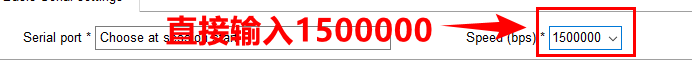

# 1.2 串口软件安装

&emsp;&emsp;这里简单的介绍CH340 USB串口驱动安装及MobaXterm终端的安装，不再详细写安装教程，比较基础。

- 安装MobaXterm终端软件（或安装Xshell，SecureCRT等终端软件）本文以MobaXterm为例。网盘路径：开发板网盘A-基础资料->3、软件->MobaXterm_Installer_v12.3.zip 。

&emsp;&emsp;双击打开这个压缩包，等待解压后，直接双击MobaXterm_installer_12.3.msi安装即可。MobaXterm安装程序将会引导安装

- 安装CH340USB串口驱动（PC机（电脑）要与开发板的串口通信，我们需要安装此驱动）
在`开发板光盘A-基础资料->4、软件-> CH341SER.EXE （如果你已经有安装过了，可以不用安装）`文件夹下找到SETUP.EXE，双击运行，然后弹出的窗口，直接点击安装，等待预安装或者安装成功窗口出现即可。`注意：开发板默认的串口波特率为1500000（1.5M），直接在MobaXterm上输入1500000`。

