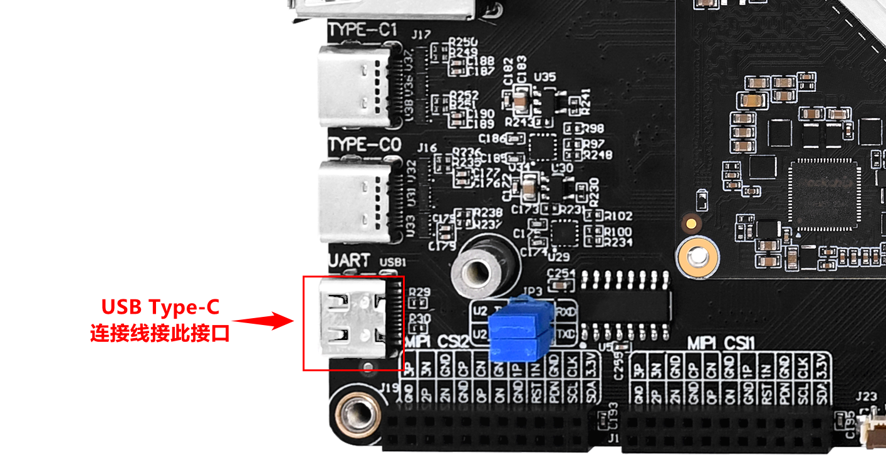
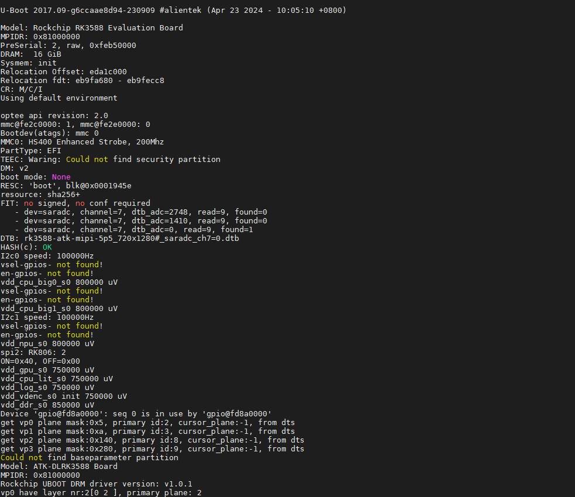

# 1.3 开发板与PC机连接

&emsp;&emsp;开发过程中我们与开发板信息交互，一般是通过串口，当然可以通过网络。网络得先知道开发板的ip。所以此时串口十分重要。

&emsp;&emsp;ATK-DLRK3588开发板默认配置两根USB Type-C连接线，在开发板找到USB Type-C座子，找到“UART”丝印字样的座子（就是调试串口），然后接上USB Type-C连接线，另一头接电脑主机USB接口。

&emsp;&emsp;打开电源开关，上电，预装的系统为Buildroot Linux系统。串口输出的信息如下(部分)。

