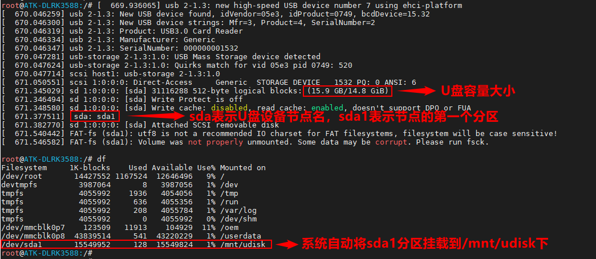
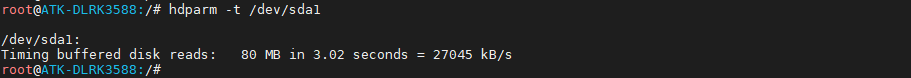
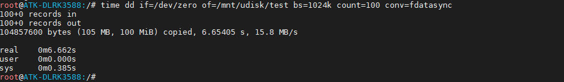
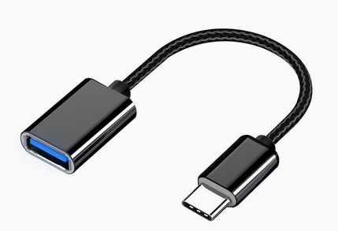

# 3.10 USB测试

&emsp;&emsp;USB包括2个USB2.0接口和两个全功能USB Type-C接口。

<center>

</center>


## 3.10.1 USB HOST测试

&emsp;&emsp;将一张FAT32格式的U盘用读卡器，直接插在ATK-DLRK3588底板的USB接口上（2个USB 2.0接口都行。

<center>

</center>

&emsp;&emsp;我们可以直接进入/mnt/udisk目录进入读写文件操作。注意：测试读写速度与个人读卡器或U盘/TF卡的最大读写速度有关。

&emsp;&emsp;读速度测试：

```c#
hdparm -t /dev/sda1
```

<center>

</center>

&emsp;&emsp;写速度测试：

```c#
time dd if=/dev/zero of=/mnt/udisk/test bs=1024k count=100 conv=fdatasync
rm /mnt/udisk/test
```

&emsp;&emsp;这里代表写入100MiB的文件，写入速度为15.8 MB/s。实际上写入的文件越大求平均写入速度越接近实际值。

<center>

</center>

## 3.10.2 USB TypeC从机测试

&emsp;&emsp;ATK-DLRK3588底板上全功能接口USB TypeC接口`USB TypeC0`可以使用ADB功能，就是作为从机。请参考正点原子编写的ADB使用手册。`USB TypeC1不做ADB功能`。

## 3.10.3 USB TypeC主机测试

&emsp;&emsp;使用USB转Tpye-C连接线（若用户手上没有此连接线可不做此实验）接上U盘，插到USB TypeC0/ USB TypeC1接口处，和3.10.1小节一样测试即可。

&emsp;&emsp;USB转Tpye-C连接线如下，此连接线请自行按需购买。

<center>

</center>