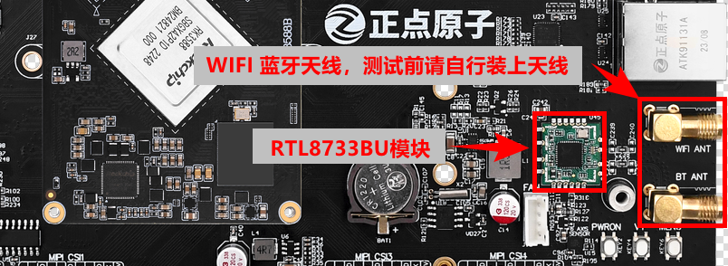
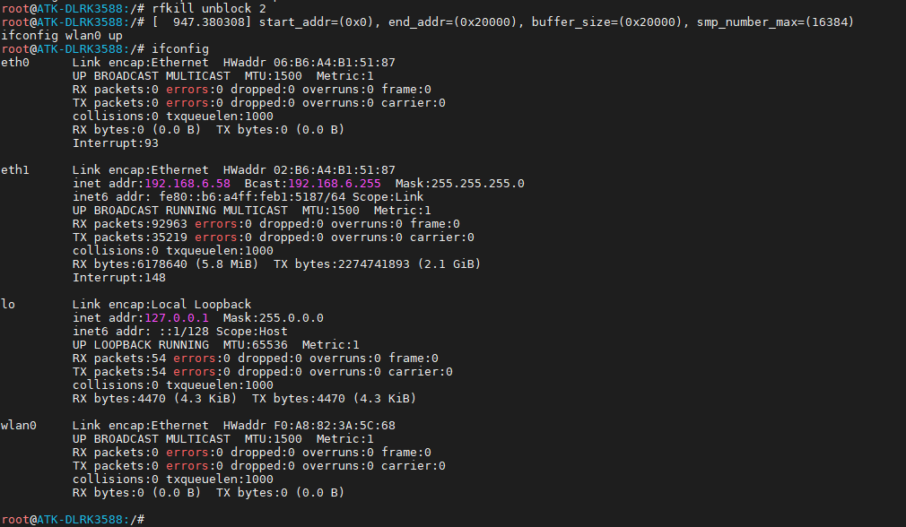
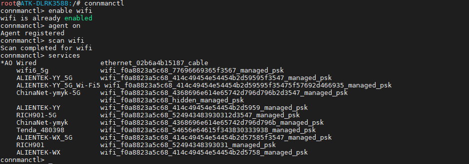
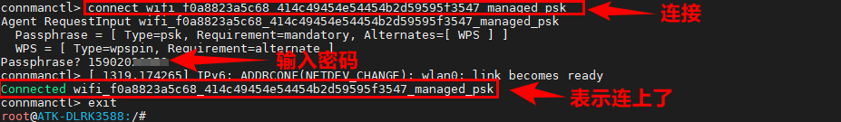
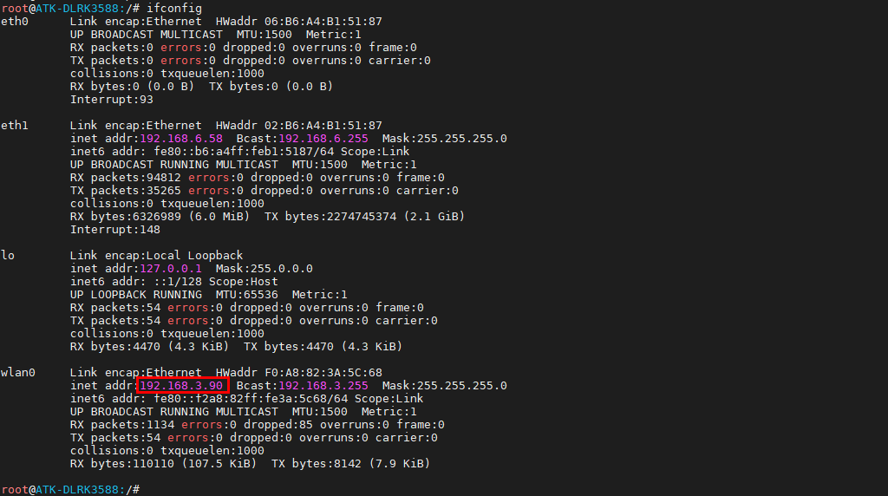
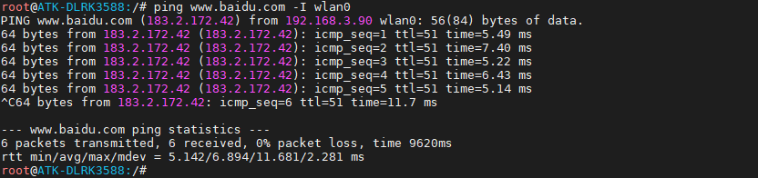
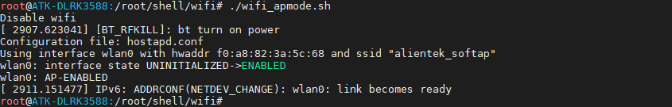
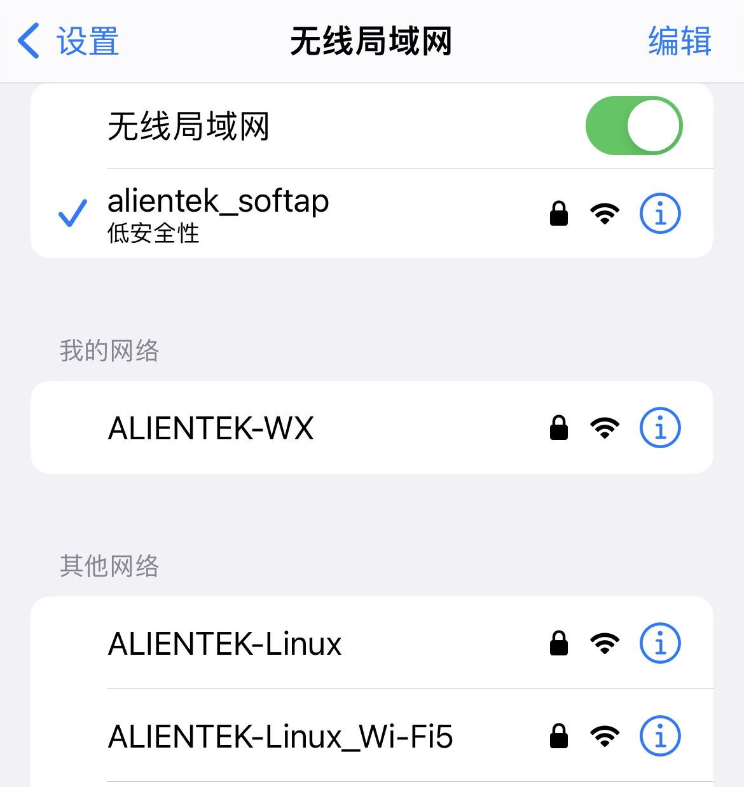
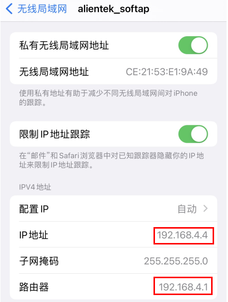
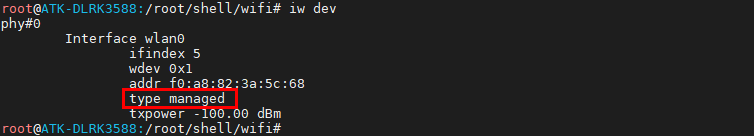

# 3.12 板载USB WIFI测试

&emsp;&emsp;ATK-DLRK3588板载了一个RTL8733BU芯片，此芯片是WIFI和蓝牙二合一。开机使用/etc/init.d/S36wifibt-init.sh初始化WIFI驱动和蓝牙驱动。

<center>

</center>

## 3.12.1 station模式

&emsp;&emsp;WiFi的Station模式是一种工作模式，它使WiFi设备能够连接到一个WiFi网络并与其他设备进行通信。在Station模式下，WiFi设备可以作为一个客户端连接到一个已有的WiFi网络，这个网络可以是家庭、办公室或公共场所提供的无线网络。

&emsp;&emsp;在连接上WiFi网络后，设备就可以通过这个网络与其他设备进行数据传输和通信。通常，Station模式适用于需要将设备连接到已有的WiFi网络中的场景，例如手机、电脑、智能家居设备等。

&emsp;&emsp;注意，默认wlan0是没有打开的。

```c#
rfkill unblock 2	# 解锁射频，wlan0是2，若需要查看对应的设备请输入rfkill
ifconfig wlan0 up 	# 打开wlan0，若未开启可以输入这个指令。
ifconfig		# 查看wlan0是否开启。可以看到下图开启了。
```

<center>

</center>

&emsp;&emsp;我们可以使用下面指令来连接wifi。

```c#
	connmanctl				#进入WIIF操作终端
	connmanctl> enable wifi 	#使能WIFI，默认已经使能
	connmanctl> agent on		#开启代理
	connmanctl> scan wifi 		#开启WIFI扫描，可以多次扫描
	connmanctl> services 		#列出扫描到的WIFI列表
```

&emsp;&emsp;命令运行结果如下所示：

<center>

</center>

&emsp;&emsp;从扫描到WIFI列表中，使用connect XXXX进行连接，再输入密码按回车确认。比如笔者要连接“ALIENTEK-YY_5G”，（`若使用IOS手机热点，开启IOS热点时可能需要选择兼容性，同时也要注意，如果WIFI信号很差（离太远），或者输入密码都有可能连接不上WIFI，测试时请确认这两个因素`）运行结果如下命令：

```c#
connect wifi_f0a8823a5c68_414c49454e54454b2d59595f3547_managed_psk   #连接
exit                         #退出终端
```

<center>

</center>

&emsp;&emsp;连接成功后，可以使用ifconfig指令查看我们的wlan0所获取到IP地址。

<center>

</center>

&emsp;&emsp;ping百度测试连通性，也可以ping网关来测试WIFI的连通性。

```c#
ifconfig eth1 down               #因为wlan0的网关与eth1的网关不一样，要关掉
ping www.baidu.com -I wlan0      #ping百度测试
ping 192.168.3.1 -I wlan0        #ping网关，请改为自己的网关，192.168.x.x
```

<center>

</center>

## 3.12.2 softap模式

&emsp;&emsp;WiFi的SoftAP模式是一种工作模式，它允许WiFi设备像一个无线路由器一样工作。在SoftAP模式下，WiFi设备可以作为一个热点，允许其他设备连接并使用它提供的网络服务。

&emsp;&emsp;通常，SoftAP模式适用于需要将设备转化为一个无线热点的场景，例如智能家居设备、无线打印机、游戏机等。在SoftAP模式下，设备可以设置SSID、密码等参数，允许其他设备连接并通过它提供的网络服务进行数据传输和通信。

&emsp;&emsp;由于SoftAP模式可以使设备像一个无线路由器一样工作，因此它通常被用于一些特殊的场景，例如网络调试、数据采集等。

&emsp;&emsp;正点原子编写的开启热点的脚本都放在了/root/shell/wifi目录下，如下图。

<center>

</center>

&emsp;&emsp;dnsmasq.conf文件内容如下：

```c#
interface=wlan0
dhcp-range=192.168.4.2,192.168.4.254,255.255.255.0,24h
port=49153
```

&emsp;&emsp;hostapd.conf文件内容如下：

```c#
interface=wlan0
ssid=alientek_softap
driver=nl80211
channel=6
hw_mode=g
ignore_broadcast_ssid=0
auth_algs=1
wpa=3
wpa_passphrase=12345678
wpa_key_mgmt=WPA-PSK
wpa_pairwise=TKIP
rsn_pairwise=CCMP
```

&emsp;&emsp;wifi_apmode.sh文件内容如下：

```c#
#注意可能是rfkill1,如果5G不配置的情况下，默认5G是配置的，rfkill0是蓝牙的
echo 0 > /sys/class/rfkill/rfkill2/state
sleep 2
echo 1 > /sys/class/rfkill/rfkill2/state
sleep 2

if [[ "$(pidof dnsmasq)" != "" ]]
then
    kill -9 $(pidof dnsmasq)
fi

if [[ "$(pidof hostapd)" != "" ]]
then
    kill -9 $(pidof hostapd)
fi
connmanctl disable wifi
rfkill unblock all
ifconfig wlan0 down
sleep 1
ifconfig wlan0 up
sleep 1
dnsmasq -C dnsmasq.conf
ifconfig wlan0 192.168.4.1
hostapd hostapd.conf -B
```

&emsp;&emsp;进入/root/shell/wifi/目录下，执行下面指令，开启热点。成功开启热点如下图。

```c#
./wifi_apmode.sh
```

<center>

</center>

&emsp;&emsp;用手机连接测试热点名称“alientek_softap”即可，密码是hostapd.conf文件里配置的“12345678”。如下图，笔者用手机连接上了板子发出的热点。


<center>

</center>

&emsp;&emsp;可以看到，板子的ip是是我们wifi_apmode.sh设置的wlan0 ip 192.168.4.，充当了网关即路由器。并且手机也从开发板分配得到了一个ip为192.168.4.4。

&emsp;&emsp;注意这个热点能连接，但是不是给你上网用的，本次演示仅限局域网内连接，可以编写网络通信程序进行信息收发，热点的用途很大，比如你想附近一个设备与你的板子通信都是可以通过此热点进行信息交互，详细请看Qt或者C应用教程的网络编程部分。

<center>

</center>

&emsp;&emsp;开启了AP模式，我们如何关闭AP模式呢？在前面的脚本中我们使用了hostapd和dnsmasq开启了AP模式，并作为后台进程，所以我们需要关闭这两个进程。就可以关闭AP模式。执行下面的指令关闭进程。

```c#
killall hostapd dnsmasq
```

<center>

</center>

&emsp;&emsp;也可以直接使用iw指令设置wifi的客户端模式。不过最好也关闭上面的两个进程防止占用资源！

```c#
iw dev wlan0 set type managed
```

<center>

</center>


&emsp;&emsp;此时我们使用iw dev指令查看无线网络接口。看到无线网络的类型为managed即为客户端模式，也是我们上面说的station模式。

```c#
iw dev
```

<center>

</center>


