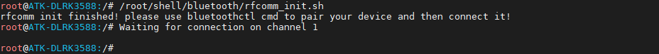
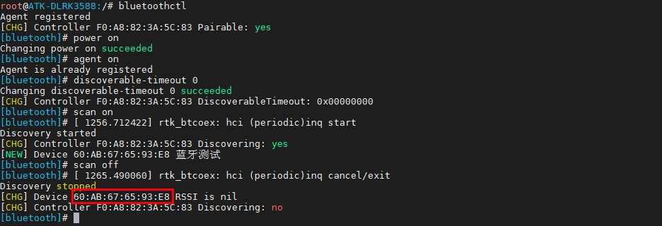
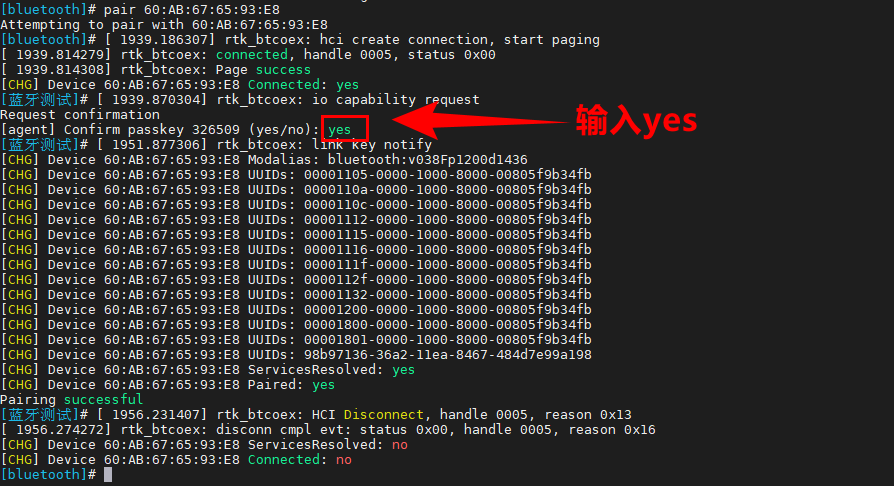
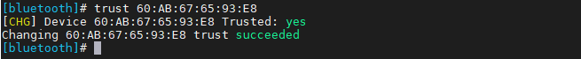
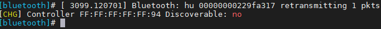
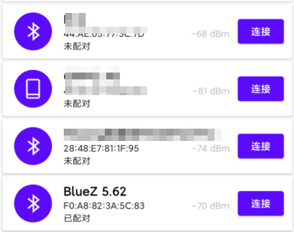
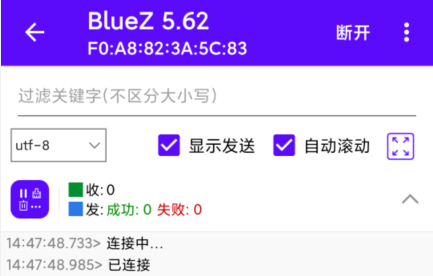
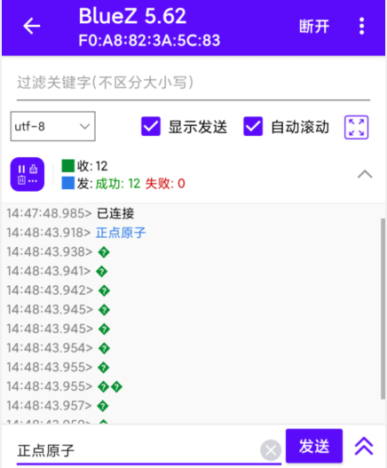
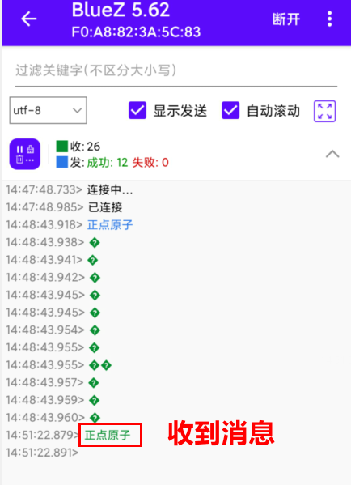
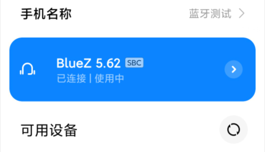

# 3.13 板载USB蓝牙测试

&emsp;&emsp;蓝牙开发依赖Buildroot，蓝牙驱动模块rtk_btusb.ko等文件都是Buildroot配置选择正确的Wi-Fi/BT模组的前提下才会生成。

&emsp;&emsp;蓝牙协议有非常多，如下。<br />
&emsp;&emsp;1.L2CAP: 逻辑链路控制和适配协议，用于建立和维护逻辑链路连接。<br />
&emsp;&emsp;2.RFCOMM: 远程串口协议，将串口设备的数据传输映射到蓝牙上。<br />
&emsp;&emsp;3.SDP: 服务发现协议，用于查找和描述可用的蓝牙服务。<br />
&emsp;&emsp;4.GAP: 通用访问协议，定义了设备之间的基本连接和通信规则。<br />
&emsp;&emsp;5.GATT: 通用属性协议，用于建立和管理设备之间的属性数据交换。<br />
&emsp;&emsp;6.ATT: 属性协议，用于在蓝牙设备之间传输属性值。<br />
&emsp;&emsp;7.HFP: 手机蓝牙耳机协议，用于手机和蓝牙耳机之间的音频通信。<br />
&emsp;&emsp;8.A2DP: 高级音频分发协议，用于在蓝牙设备之间传输高质量音频数据。<br />
&emsp;&emsp;9.AVRCP: 音频/视频远程控制协议，用于在蓝牙设备之间传输媒体控制命令。

&emsp;&emsp;笔者水平有限，蓝牙是一个很大的知识点，本次仅以演示蓝牙RFCOMM远程串口使用方法，其他协议可以自行研究。

&emsp;&emsp;Buildroot系统路径下就有板载的蓝牙驱动模块/lib/modules/rtk_btusb.ko。
Buildroot系统路径下就有板载的蓝牙驱动模块/lib/modules/rtk_btusb.ko。

## 3.13.1 蓝牙初始化

&emsp;&emsp;蓝牙初始化开机自启动/etc/init.d/S36wifibt-init.sh初始化蓝牙驱动和WIFI驱动。

## 3.13.2 蓝牙rfcomm

&emsp;&emsp;蓝牙RFCOMM是一种蓝牙协议，它提供了一种串行数据传输的方式，可以在蓝牙设备之间进行数据传输。RFCOMM可以将串行数据转换为蓝牙的数据包，从而实现无线传输。

&emsp;&emsp;RFCOMM提供了一种虚拟串口的概念，使得蓝牙设备之间的数据传输可以像串口一样进行。这种方式广泛应用于蓝牙耳机、蓝牙打印机等设备上。

&emsp;&emsp;在使用RFCOMM进行数据传输时，需要先建立蓝牙连接，并且指定RFCOMM通道。然后，在连接两端的设备中，可以通过RFCOMM发送和接收数据。这种方式适用于需要进行串口通信的应用场景，例如无线控制器、无线传感器等。

&emsp;&emsp;笔者编写了开启蓝牙rfcomm建立rfcomm通道的脚本，位于/root/shell/bluetooth/rfcomm_init.sh。脚本的内容如下。

```c#
if [[ "$(pidof rfcomm)" != "" ]]
then
    kill -9 $(pidof rfcomm)
fi
hciconfig hci0 piscan
hciconfig hci0 noauth
sleep 1
sdptool add SP
sleep 1
rfcomm watch hci0 &
echo "rfcomm init finished! please use bluetoothctl cmd to pair your device and then connect it!"
```

&emsp;&emsp;执行rfcomm_init.sh脚本，可以看到已经创建了通道1，等待连接。

```c#
rfcomm_init.sh
```

<center>

</center>

&emsp;&emsp;此时我们需要进行蓝牙配对，然后使用安卓手机“蓝牙调试宝”App进行连接。苹果手机没有类似软件。

## 3.13.3 蓝牙配对

&emsp;&emsp;输入下面指令，进入bluetoothctl交互模式。

```c#
bluetoothctl
```

&emsp;&emsp;依次执行下面指令。

```c#
power on						# 打开电源
agent on						# 开启代理
discoverable on				# 开启可被检测，默认有个可发现时长，如果你想让它一直可被搜索，请写为discoverable-timeout 0，0代表无限时长
scan on						# 开启扫描设备
```

&emsp;&emsp;等到扫描到自己的蓝牙设备，输入scan off停止扫描。

```c#
scan off
```

<center>

</center>

&emsp;&emsp;笔者扫描到安卓手机蓝牙MAC地址，如上图，确认后就可以进行配对了。

&emsp;&emsp;输入下面指令进行配对。

```c#
pair 60:AB:67:65:93:E8				# 请填写你自己的蓝牙MAC
```

<center>

</center>

&emsp;&emsp;手机端也弹出配对码。

<center>

</center>

&emsp;&emsp;输入下面的指令信任MAC。

```c#
trust 60:AB:67:65:93:E8				# 请填写你自己的蓝牙MAC
```

<center>

</center>


## 3.13.4 蓝牙通信测试

&emsp;&emsp;安卓手机安装蓝牙调试宝，打开软件后，已经配对和未配对的蓝牙会显示在列表里（如果搜索不到，可能是需要再开启被扫描），如下图发现模式被关闭了。需要执行discoverable on或者退出交互终端后执行hciconfig hci0 piscan再次开启。

<center>

</center>

&emsp;&emsp;蓝牙调试宝，打开软件后，已经配对蓝牙显示如下图。

<center>

</center>

&emsp;&emsp;点击连接，默认uuid即可，可以看到下图，已经连接上了。可以进行数据收发了。

<center>

</center>

&emsp;&emsp;板子接收数据可以使用cat指令进行收数据。注意，连接成功之后才会产生/dev/rfcomm0。

```c#
cat /dev/rfcomm0
```

&emsp;&emsp;然后在手机向开发板发送数据，如下图。

<center>

</center>

&emsp;&emsp;开发板收到的数据如下。

<center>

</center>

&emsp;&emsp;同理，我们可以向手机发送数据。执行下面指令。

```c#
echo "正点原子" > /dev/rfcomm0
```

<center>

</center>

<center>

</center>

## 3.13.5 蓝牙音乐

&emsp;&emsp;配对完成后，连接安卓/IOS手机，手机播放音乐，开发板充当蓝牙耳机，可播放手机的音频。在手机上点击连接开发板的蓝牙如下图，开发板被识别为耳机。

<center>

</center>


