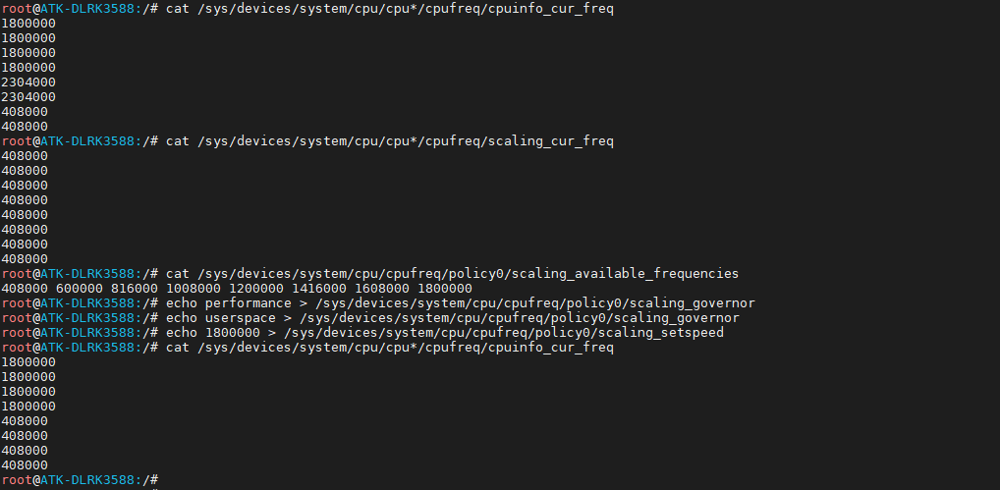

# 3.17 CPU频率

&emsp;&emsp;命令如下所示：

&emsp;&emsp;查看当前运行CPU频率。

```c#
cat /sys/devices/system/cpu/cpu*/cpufreq/cpuinfo_cur_freq
```

&emsp;&emsp;查看软件上最后一次设置的CPU频率

```c#
cat /sys/devices/system/cpu/cpu*/cpufreq/scaling_cur_freq	
```

&emsp;&emsp;查看支持的CPU频率

```c#
cat /sys/devices/system/cpu/cpufreq/policy0/scaling_available_frequencies 
```

&emsp;&emsp;使能CPU性能模式，跑最高频，本次调节的小核心。注意，测试8K视频播放建议开启性能模式！而且全部核心都建议开启，否则可能卡顿哦，笔者已经测试过了，开启就流畅好多！

```c#
echo performance > /sys/devices/system/cpu/cpufreq/policy0/scaling_governor	
echo performance > /sys/devices/system/cpu/cpufreq/policy4/scaling_governor	 # 2个大核心
echo performance > /sys/devices/system/cpu/cpufreq/policy6/scaling_governor	 # 2个大核心
```

&emsp;&emsp;切换governor到userspace

```c#
echo userspace > /sys/devices/system/cpu/cpufreq/policy0/scaling_governor
echo userspace > /sys/devices/system/cpu/cpufreq/policy4/scaling_governor	# 2个大核心
echo userspace > /sys/devices/system/cpu/cpufreq/policy6/scaling_governor	# 2个大核心
```

&emsp;&emsp;设置CPU频率 需要先切换到userspace，注意本次只是演示调整小核的主频。

```c#
echo 1800000 > /sys/devices/system/cpu/cpufreq/policy0/scaling_setspeed
echo 2304000> /sys/devices/system/cpu/cpufreq/policy4/scaling_setspeed 	# 2个大核心
echo 2304000> /sys/devices/system/cpu/cpufreq/policy6/scaling_setspeed 	# 2个大核心
```

&emsp;&emsp;再查看当前运行CPU频率

```c#
cat /sys/devices/system/cpu/cpu*/cpufreq/cpuinfo_cur_freq
```

<center>

</center>


