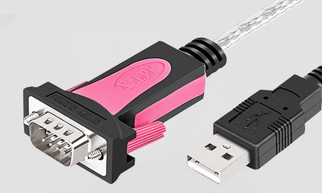
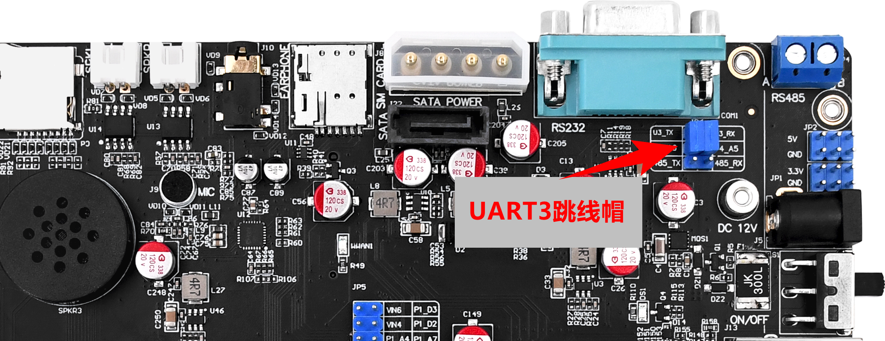
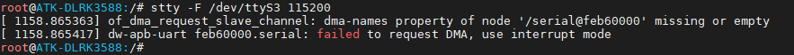
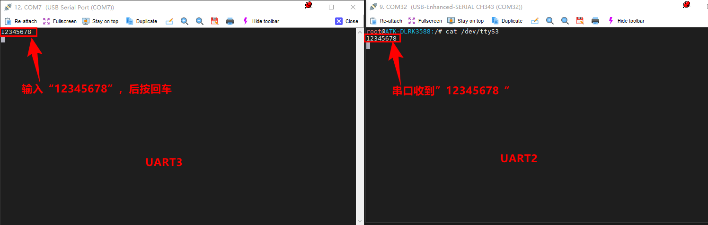
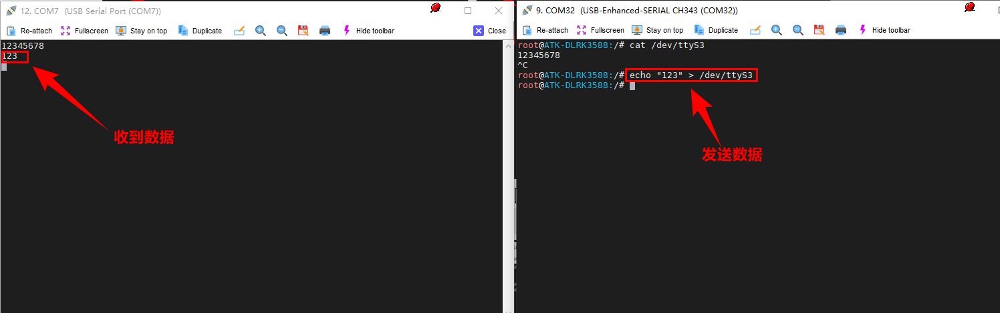
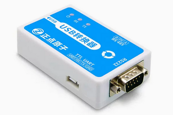

# 3.19 串口测试

&emsp;&emsp;正点原子ATK-DLRK3588开发板底板上引出了两路串口接口，RK3588支持的串口数量最大是10路。

&emsp;&emsp;开发板板载引出的串口如下图（不算被复用（引出的IO排针）。


<center>

</center>

## 3.19.1 UART2测试

&emsp;&emsp;其中UART2就是我们所使用的调试串口，使用USB-TypeC连接线连接再连接上位机，默认信息都会这里打印，默认波特率为1500000（1.5M）能输入和打印信息说明串口正常。

## 3.19.2 UART3（RS232）测试

&emsp;&emsp;开发板上的UART3连接的是RS232 DB9接口（母头），如果需要测试这个串口，那么就需要有一个USB转RS232的串口线（USB转RS232的串口线属于非开发板配件，请自行配备），而且需要是公头的（正点原子店铺有售卖），如下图。

<center>

</center>

`测试前请检查开发板的跳线帽是否正常接上，防止快递运输过程中松动或者脱落且需要检查是否按如下图所示接法，请认真对比再测试！`如下图位置。

<center>

</center>

&emsp;&emsp;设置串口波特率，将USB转RS232串口线连接开发板再连接电脑USB接口，打开Mobaxterm上位机。

```c#
stty -F /dev/ttyS3 115200
```

<center>

</center>

&emsp;&emsp;上位机Mobaxterm配置相同的波特率115200与选择对应COM口后，如下图所示。其中UART3就是我们要测试的串口，UART2为调试串口。UART2调试串口需要输入如下指令，等待UART3发送。

```c#
cat /dev/ttyS3
```

<center>

</center>

&emsp;&emsp;同时，我们在调试串口中向UART3发送数据，那么执行下面的指令。

```c#
echo "123" > /dev/ttyS3
```

<center>

</center>

&emsp;&emsp;若收到数据，说明UART3收发都正常。

## 3.19.3 UART3（RS485）测试

&emsp;&emsp;同理，UART4测试步骤与上一小节3.19.2一样。此时我们需要一个RS485转串口模块，此模块正点原子店铺有售卖，当然用户手上有其他可以测试485的工具也可以自己测试。注意485是半双工的，不能同时收发。

&emsp;&emsp;正点原子店铺有售卖USB串口转换器三合一（支持485测试），如下图。接上杜邦线，A对A，B对B连接到开发板的RS485接口。按上一小节3.19.2步骤测试即可RS485接口是否正常工作即可。

<center>

</center>


