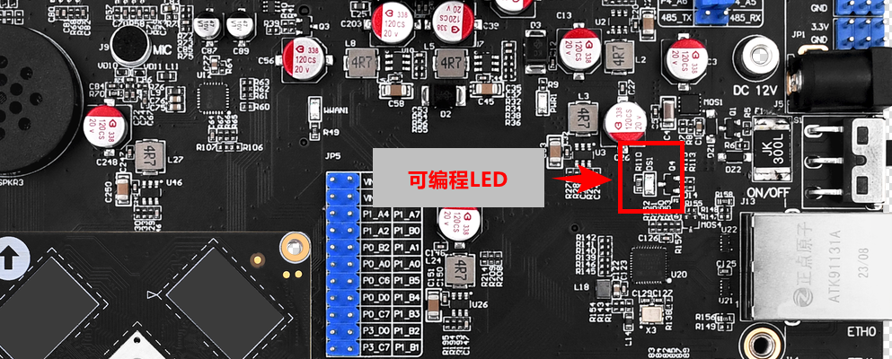

# 3.1 LED测试

&emsp;&emsp;正点原子ATK-DLRK3588开发板上有配备一个用户LED。它们在底板原理图对应硬件管脚的关系如下表。在出厂系统里，我们把LED作为心跳灯（可编程使用），一般用于指示系统是否正常运行。

<center>

</center>
| 管脚名称             | WORKING_LEDEN_H |
| :------------------: | :-------------: |
| 正点原子ATK-DLRK3588 | GPIO1_A3        |

&emsp;&emsp;在出厂系统里，我们可以通过如下指令来控制LED状态。输入后查看开发板上的LED的状态。

```c#
cat /sys/class/leds/work/trigger			#查看LED0的当前触发方式及支持的触发方式，默认为[heartbeat]
echo none > /sys/class/leds/work/trigger	#改变LED0的触发模式
echo 1 > /sys/class/leds/work/brightness	#点亮LED0，此时为常亮状态，取值为>0的正整数，一般写1
echo 0 > /sys/class/leds/work/brightness	#熄灭LED0，此时为熄灭状态，取值为0
```


