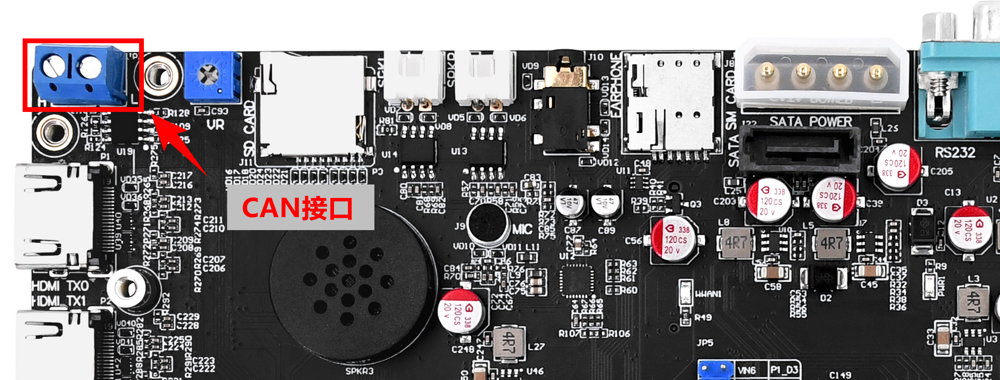

# 3.20 CAN测试

&emsp;&emsp;CAN（Controller Area Network，控制器局域网）是一种用于实时控制系统和网络通信的串行通信协议，最早由德国博世公司（Bosch）于 1980 年代开发。它在汽车电子领域得到了广泛应用，用于连接和通信车辆中的各种电子控制单元（ECU），如引擎控制单元、传感器、执行器等。


&emsp;&emsp;测试CAN需要用户手上有USB CAN（FD）分析仪，如周立功的CAN(FD)分析仪等，如果用户是搞CAN这块的，那么这部分用户应该有CAN(FD)分析仪。

&emsp;&emsp;如果你是初学者，需要购买CAN(FD)分析仪，测试CAN就需要购买CAN(FD)分析仪。或者两块开发板CAN接口对接也可以测试，有条件或者需求就购买CAN(FD)分析仪。但是USB CAN(FD)分析仪往往价格不菲，比一套板子还要贵。

&emsp;&emsp;周立功的USBCANFD 200U可以测试CAN或者CANFD。注意CAN是半双工的，不能同时收发。

&emsp;&emsp;本次实验就使用了周立功的USB CANFD分析仪，如下图。注意，关于CANFD分析仪的使用请咨询商家，本实验不讲解USB CANFD分析仪的使用。


<center>

</center>

&emsp;&emsp;开发板CAN接口位置如下。

<center>

</center>

&emsp;&emsp;将USB CANFD分析仪一个通道的CANH接开发板的CAN接口处的H，CANL接开发板的CAN接口处的L，启动CAN上位机。

&emsp;&emsp;输入下面的指令配置CAN。

```c#
ip link set can0 up type can bitrate 1000000
```

&emsp;&emsp;指令解释：<br />
&emsp;&emsp;1.	ip link set can0 up：将CAN0接口设置为启用状态。<br />
&emsp;&emsp;2.	type can：将CAN总线类型设置为CAN。<br />
&emsp;&emsp;3.	bitrate 1000000：将CAN总线的比特率设置为1Mbps（1000000 bits/sec）。

&emsp;&emsp;注CAN总线通常支持从1 kbps（千位每秒）到1 Mbps（兆位每秒）的位速率范围，一般取值为800k、500k、250k、125k、100k和50k。

<center>

</center>

&emsp;&emsp;执行下面的指令打印CAN的信息。

```c#
ip -details link show can0
```

<center>

</center>

&emsp;&emsp;CAN发送:

&emsp;&emsp;发送（标准帧,数据帧,ID:123,data:DEADBEEF）:

```c#
cansend can0 123#DEADBEEF
```

&emsp;&emsp;发送（标准帧,远程帧,ID:123）:

```c#
cansend can0 123#R
```

&emsp;&emsp;发送（扩展帧,数据帧,ID:00000123,data:12345678）:

```c#
cansend can0 00000123#12345678
```

&emsp;&emsp;发送（扩展帧,远程帧,ID:00000123）:

```c#
cansend can0 00000123#R
```

<center>

</center>

&emsp;&emsp;CAN上位机收到数据如下。

<center>

</center>

&emsp;&emsp;CAN接收数据输入下面的指令等待接收：

```c#
candump can0
```

&emsp;&emsp;CAN上位机发送数据如下图，这次我们发送8个字节。

<center>

</center>

&emsp;&emsp;开发板接收到8个字节如下图。

<center>

</center>

&emsp;&emsp;CAN随机生成数据发送，发8个字节。脚本如下。

```c#
#!/bin/bash

# 循环发送10000次
for ((i = 1; i <= 10000; i++)); do
    # 生成随机的8字节数据（16个十六进制数字）
    random_data=$(od -A n -t x8 -N 8 /dev/urandom | tr -d ' ')

    # 构建cansend命令
    cansend_cmd="cansend can0 123#${random_data}"

    # 执行cansend命令
    eval $cansend_cmd

    echo "Sent CAN frame $i with data: $random_data"

    # 等待一段时间，以控制发送速率（单位：秒）
    sleep 0.01
done
```

&emsp;&emsp;上位脚本发送10000帧间隔100ms数据测试，等待测试完成后，上位机也发送10000帧数据间隔10ms给开发板CAN。

&emsp;&emsp;错误帧测试结果如下。错误率为0%。

<center>

</center>


