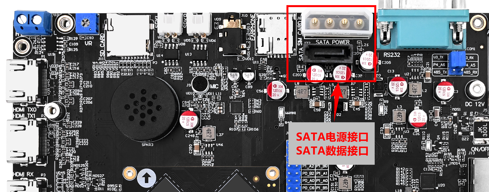
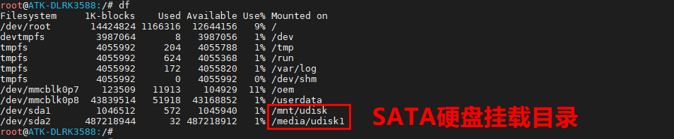

# 3.21 SATA接口测试

&emsp;&emsp;在某些情况下，eMMC存储容量远远不够用时，用户需要扩展存储空间，一种低成本扩大存储容量就是外接硬盘了。

&emsp;&emsp;开发板SATA接口如下图位置。


<center>

</center>

&emsp;&emsp;请将SATA接口硬盘用SATA电源接口线与SATA数据接口线接上（SATA数据线与电源线属于非开发板配件，请自行配备），可热插拨，但是为了保护你的硬盘，建议先断电再插上，然后再开机。

&emsp;&emsp;开机后使用df指令查看硬盘是否已经挂载了。

&emsp;&emsp;注意如果没有自动挂载，请检查是否插好！同时需要确认有没有/dev/sd*节点生成。如果有这个节点生成就是没识别到硬盘，如果有节点生成没有挂载，那么就是你的硬盘可能没分区或者分区损坏，请自行格式化再挂载！(格式化操作可以在将硬盘插到PC上进行，或者在Linux使用指令格式化，参考Linux驱动基础文档。)

```c#
df
```

&emsp;&emsp;可以看到下图，笔者这个SATA硬盘挂载的目录为/media/usdisk1和/mnt/udisk。因为笔者这个硬盘有两个分区，一个是sda1分区，另一个是sda2分区，所以挂载的目录有两个。

<center>

</center>


&emsp;&emsp;然后我们就可以对这个目录实行读写操作了。
