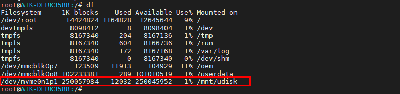

# 3.22 M.2接口测试

&emsp;&emsp;M.2接口使用PCI Express (PCIe)总线。PCIe是一种高速串行总线，用于连接计算机的内部组件，如显卡、网卡、存储设备等。M.2接口通过PCIe总线提供高速数据传输，支持传输速度高达4 GB/s

&emsp;&emsp;ATK-DLRK3588 M.2接口在开发板的背面。请使用M.2接口的固态硬盘安装在开发板的背面后（请自备M.2螺丝，一般用户购买M.2硬盘商家都有赠送或者查看配件包里是否有对应的螺丝），再上电启动。

&emsp;&emsp;上电启动后，M.2硬盘会自动挂载。

&emsp;&emsp;注意如果没有自动挂载，请检查是否插好！同时需要确认有没有/dev/nvme0n1节点生成。如果有这个节点生成就是没识别到硬盘，如果有节点生成没有挂载，那么就是你的硬盘可能没分区或者分区损坏，请自行格式化再挂载！(格式化操作可以在将硬盘插到PC上进行，或者在Linux使用指令格式化，参考Linux驱动基础文档。)

&emsp;&emsp;使用df -h指令，查看M.2硬盘挂载的节点。

```c#
df -h
```

<center>

</center>

&emsp;&emsp;可以看到M.2固态硬盘已经挂载/mnt/udisk*路径下。现在我们就可以进入/media/udisk*路径下读写文件了。

