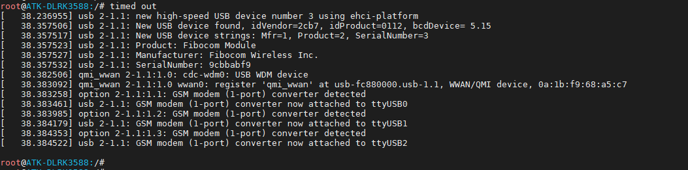
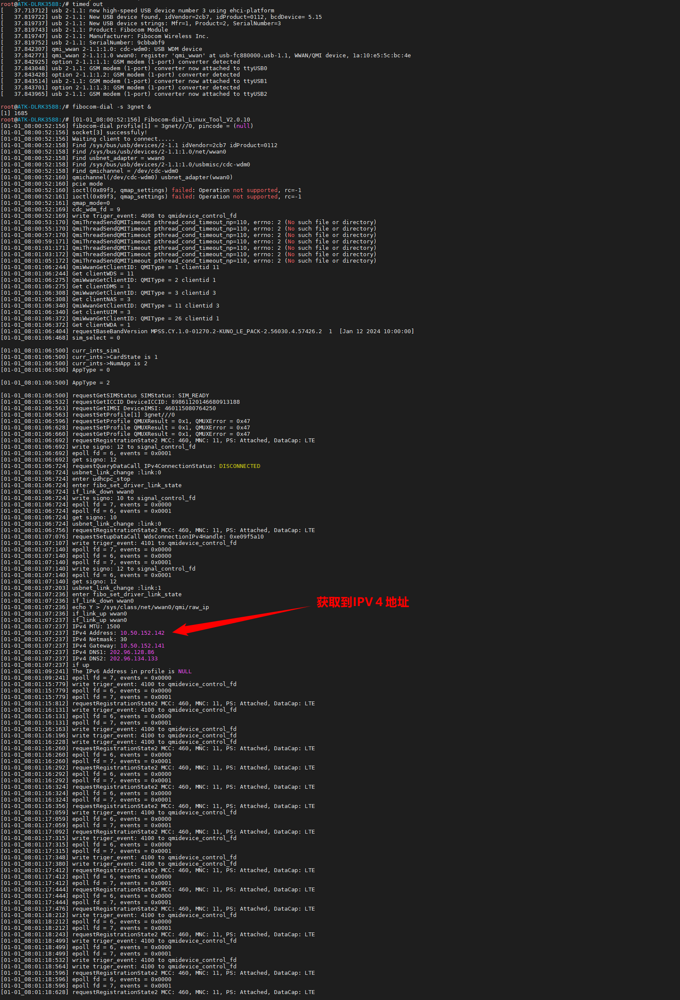
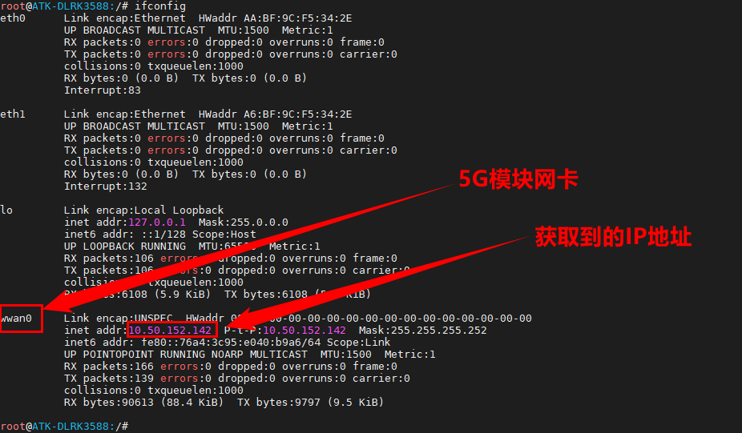
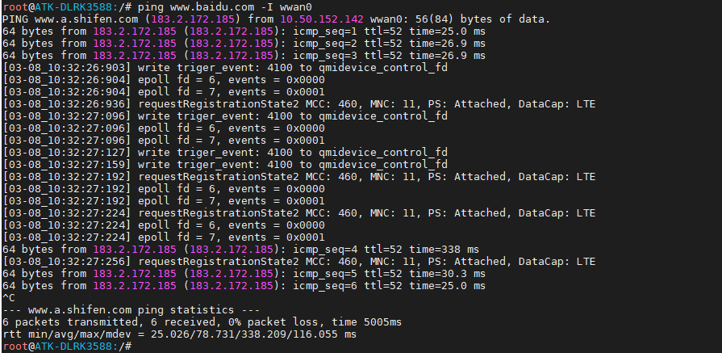

# 3.23 5G模块接口测试

## 3.23.1 5G模块上网测试


&emsp;&emsp;请准备型号为Fibocom_FG132广和通5G模块并接上天线。如下图。已经在正点原子ATK-DLRK3588开发板支持。注意必须是这种型号的5G模块！5G模块接口在开发板背面，SIM卡接口在开发板正面。

&emsp;&emsp;上电后登录到终端后，再等待约20多秒后，终端打印如下信息，说明5G模块识别加载成功。


<center>

</center>

### 3.23.1.1 拨号测试

&emsp;&emsp;ATK-DLRK3588开发板中已经集成广和通和移远的拨号工具。直接执行下面的指令进行拨号。

```c#
fibocom-dial -s 3gnet &		// 广和通使用该命令进行拨号，注此命令会打印许多fibocom-dial产生的日志，导致命令行一直刷新
quectel-CM &				// 移远使用该命令进行拨号
```

&emsp;&emsp;备注：可用`fibocom-dial -s 3gnet >/dev/null 2&>1 & `或者`quectel-CM > /dev/null 2&>1 &`// 重定向日志到/dev/null。也就是屏蔽日志。

&emsp;&emsp;执行指令后如下图，拨号程序fibocom-dial会打印日志errno类似日志约8秒钟后就开始获取IP，此现象为正常现象，获取到IP后说明拨号成功。在笔者测试这个模块使用情况来看，使用这个模块还是比较简单的。就执行一个拨号程序就可以上网了。在拨号的过程中，fibocom-dial自动打开wwan0网卡（也就是5G模块网卡）。


<center>

</center>


### 3.23.1.2 上网测试

&emsp;&emsp;输入ifconfig指令查看获取到的ip地址。

```c#
ifconfig
```

<center>

</center>

&emsp;&emsp;检验能不能上网，肯定是通过ping外网了。执行ping百度的指令。-I选项是指定网卡设备。

```c#
ping www.baidu.com -I wwan0
```

<center>

</center>

&emsp;&emsp;看到有数据回复，说明5G模块可以上网。


