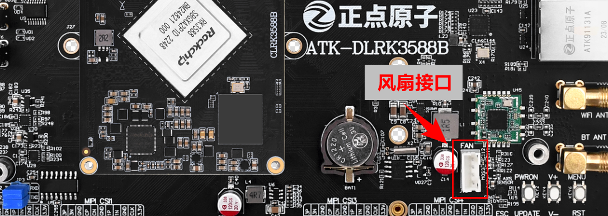

# 3.25 CPU散热风扇测试

&emsp;&emsp;请将风扇安装于核心板上，直接将风扇两个自锁座子对准核心上预留的两个孔位安装上去即可。卸下即需要拆下核心板，从核心板背面将自锁座子卸下即可，同时将风扇接头接到开发板的如下位置。详细请看淘宝页面风扇安装说明。

&emsp;&emsp;ATK-DLRK3588开发板正常上电时CPU散热风扇会转动一会，过了一会温控系统正常初始化后，风扇就会停下来，后面当CPU温度上升超过了**32度**才会开启风扇进行散热，这样的目的是为了降低整个开发板的功耗。可根据个人需要修改设备树设置风扇触发域值。

&emsp;&emsp;当在寒冷的冬天下如果开发板接的外设少，可能上到32度比较困难，风扇将不会启动。想要风扇启动，需要将CPU负载状态提升才会启动风扇。

