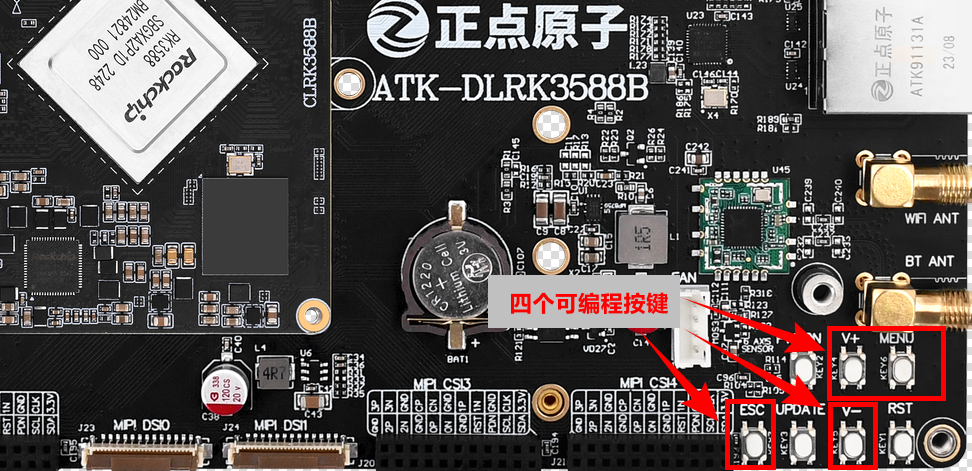
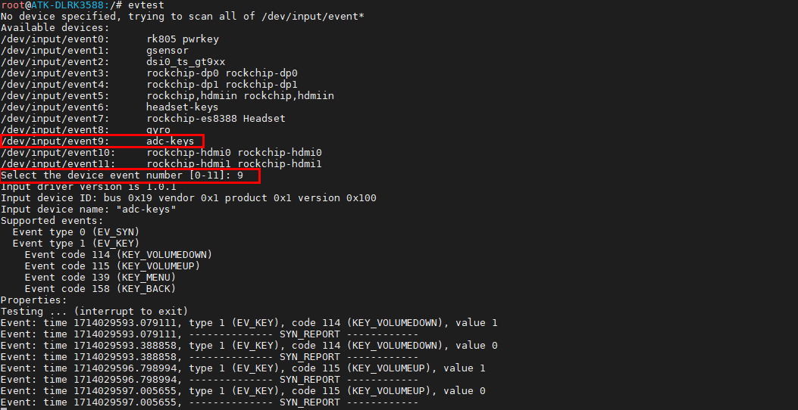

# 3.2 按键测试

&emsp;&emsp;正点原子ATK-DLRK3588开发板上有配备7个按键。其中4个按键是连接到ADC的第1通道上，按键按下去ADC可以采集到第1通道有不同的电压变化。

<center>

</center>

|            | KEY4 | KEY5 | KEY6 | KEY7 |
| :--------: | :--: | :--: | :--: | :--: |
| 按键的名称 | V+   | V-   | MENU | ESC  |
| ADC0的值   | 40   | 945  | 2027 | 2807 |

&emsp;&emsp;在开发板串口终端下运行以下命令进行测试，然后输入数字“9”，因为按键事件为event9。如需要停止测试按Ctrl + c。请按下开发板上的以上四个键，请不要按到其他键，如复位键REST等。

```c#
evtest
```

&emsp;&emsp;运行结果如下所示，可以看到按对应的按键就会打印对应的按键类型和按下时值为1，松开即为0。

<center>

</center>


