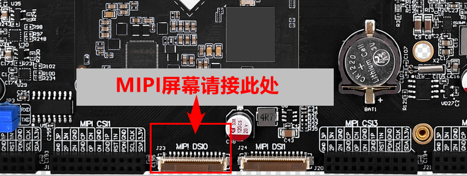
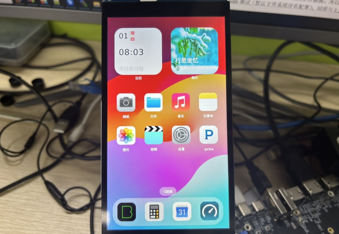
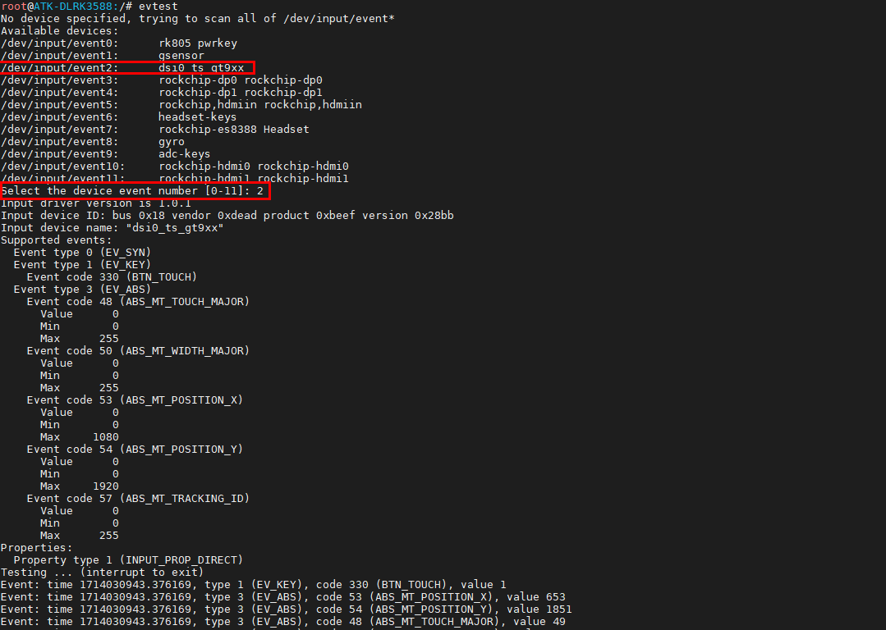
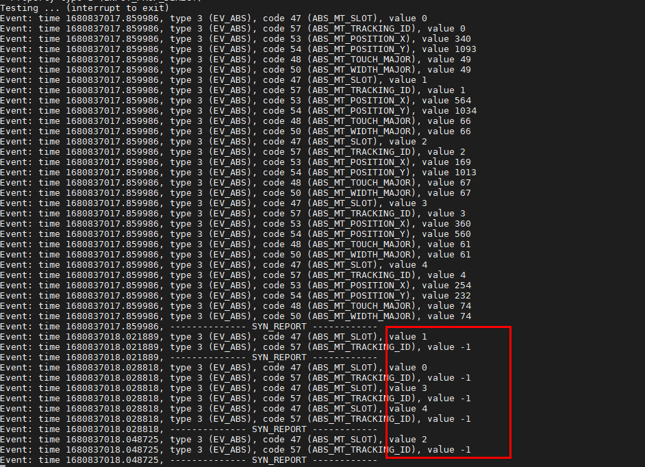

# 3.3 MIPI屏幕测试

&emsp;&emsp;在出厂系统里，因为正点原子的屏幕排线一个“ID电阻”连接到主芯片的ADC的第7通道上，所以出厂系统会识别加载不同屏的分辨率。正点原子所使用的MIPI屏幕有三种，如下表所示：


| 屏幕尺寸               | 触摸芯片 | ADC值 |
| :--------------------: | :------: | :---: |
| 5.5英寸屏(720x1280)    | gt911    | 0     |
| 5.5英寸屏(1080x1920)   | gt911    | 1410  |
| 10.1英寸屏（800x1280） | gt928    | 2748  |

&emsp;&emsp;默认Linux镜像都是只开启DSI0接口，如果你有购买MIPI屏幕，请将它接到DSI0接口处，DSI1默认是关闭的。因为weston无法使用两个DSI作为主屏。

<center>

</center>

&emsp;&emsp;5.5英寸1080P MIPI屏显示效果，实际更清晰。

<center>

</center>

## 3.3.1 触摸测试

&emsp;&emsp;开发板启动后我们使用evtest指令查看触摸屏对应的触摸事件，与3.2小节一样的方法也可以测试屏幕是否正常触摸，输入数字2，屏的对应驱动为goodix-ts。当然你点击出厂时的Qt界面，能正常触摸也是可以的。

## 3.3.2 多点触摸测试

&emsp;&emsp;MIPI屏幕最大支持5点触摸，Qt虽然支持多点触摸，但是我们使用的控件都是单点的。多点触摸要使用多点触摸的程序。所以在出厂的界面时，你无法体验到多点触摸。

&emsp;&emsp;所以我们还是使用evtest指令测试，当时你可以使用tslib测试（默认文件系统没有配置）。同理与3.2小节一样的方法也可以测试屏幕是否正常触摸，输入数字2，屏的对应驱动为goodix-ts。

```c#
evtest
```

<center>

</center>

&emsp;&emsp;可以看到如下，5个手指同时按下，value为正数时代表点的个数，为负数时代表该点松开。一共有5个点，5点触摸测试正常。

<center>

</center>


## 3.3.3 MIPI背光测试

&emsp;&emsp;MIPI屏幕的背光支持255个等级的pwm调节，亮度级数为 0～255，默认为255。数值越大，屏幕越亮。

```c#
cat /sys/class/backlight/backlight/max_brightness #查看lcd最大亮度等级
cat /sys/class/backlight/backlight/brightness #查看当前亮度等级
echo 200 > /sys/class/backlight/backlight/brightness #修改当前亮度等级观察屏的亮度变化
cat /sys/class/backlight/backlight/brightness #再查看当前亮度等级
```


