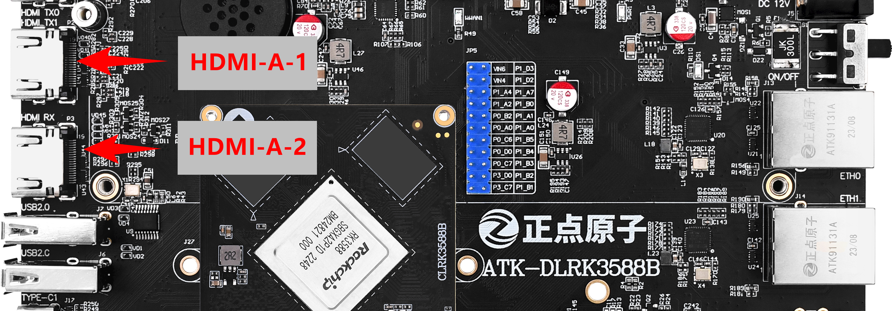
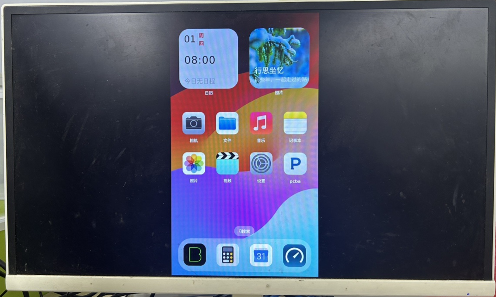
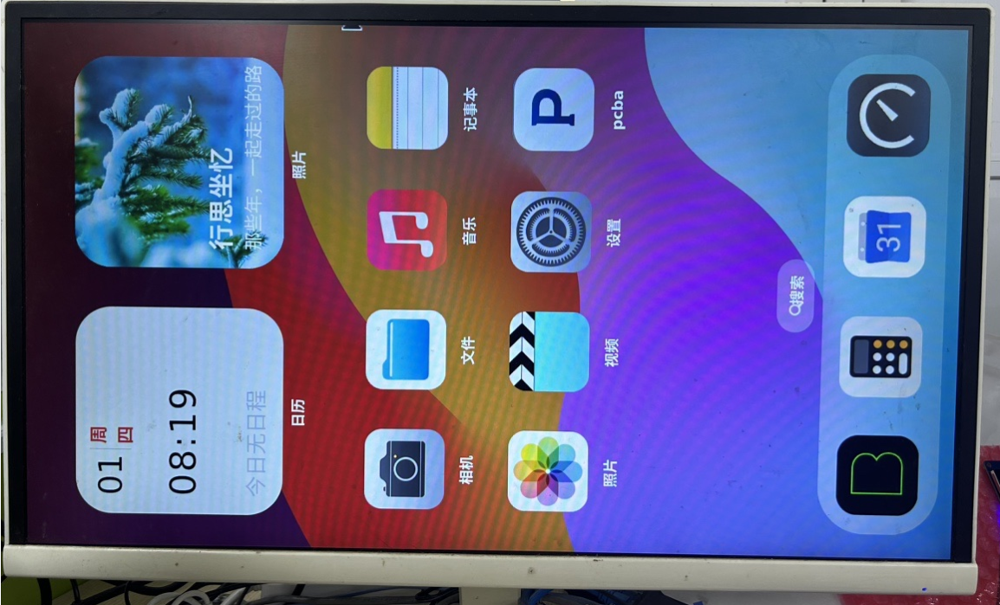

# 3.4 HDMI测试

&emsp;&emsp;注意：因市面上HDMI显示器种类多，有些显示器可能显示较慢，主要是显示器需要初始化，但是weston启动较快，导致weston无法找到输出显示，故显示黑屏。

&emsp;&emsp;需要按如下步骤解决。若某些特殊的显示器无法与开发板识别对应的分辨率，那么你可以按【正点原子】基于Buildroot系统weston桌面Qt显示设置来强制设置对应的分辨率。更多参考请查看RK官方文档HDMI相关设置。

```c#
/etc/init.d/S49weston restart				# 重启weston
/etc/init.d/S50systemui restart				# 重启ui
```

&emsp;&emsp;默认出厂Linux系统就支持HDMI，请使用HDMI线连接显示器测试显示即可。注意：出厂Qt界面适配9：16的分辨率屏幕，也就是如720x1280, 1080x1920,2160x3840都支持。

&emsp;&emsp;但是一般显示器都是16：9分辨率显示，也就是1280x720, 1920x1080,3840x2160（最大分辨率不超8K30fps）。

&emsp;&emsp;默认MIPI屏为主屏，当你接上了MIPI，HDMI等其他屏是副屏，副屏会映射主屏的内容，所你的会看到一个居中的UI界面。这是因为MIPI是竖屏，HDMI是横屏，它们的比例不适配，所以映射的内容会居中。

&emsp;&emsp;weston相关配置请参考Rockchip_Developer_Guide_Buildroot_Weston_CN.pdf和【正点原子】基于Buildroot系统weston桌面Qt显示设置。

&emsp;&emsp;插上HDMI线到下图的HDMI-A-2或者HDMI-A-1接口。

<center>

</center>

&emsp;&emsp;HDMI显示屏显示结果如下。

<center>

</center>

&emsp;&emsp;注：当你只有HMDI时，不接MIPI屏，那么HDMI就是主屏。那么HDMI上的UI会铺满整个HDMI屏幕，显示就会错位，你如果要体验我们开发的UI功能，那么你需要旋转HMDI屏幕。

```c#
echo "output:HDMI-A-2:rotate90" > /tmp/.weston_drm.conf  # 可能是HDMI-A-1，根据你插的HDMI接口位置！
/etc/init.d/S50systemui restart    # ui重启才会适配旋转后的竖屏，建议你的屏幕物理旋转90度才能体验UI。
```

<center>

</center>

&emsp;&emsp;请注意：热插拨设备为主屏时不能拨掉，否则weston找不到屏幕输出，weston会挂掉，需要重启weston再重启UI。同时也建议你接了HDMI后再开机，否则weston也会找不到地方显示。

```c#
/etc/init.d/S49weston restart				# 重启weston
/etc/init.d/S50systemui restart				# 重启ui
```

