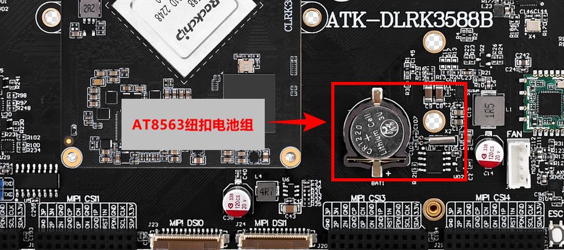
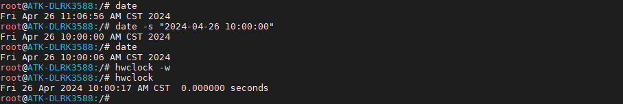

# 3.6 RTC时钟测试

&emsp;&emsp;ATK-DLRK3588开发板有一个硬件时钟，底板上有一个RTC时钟芯片AT8563T，都属于芯片外部RTC时钟。若需要提高时钟的精度，需要用高精度的晶振。

<center>

</center>

&emsp;&emsp;请检查开发板底板上是否有安装RTC纽扣电池。也可以用万用表检查RTC电池有没有电，测出来是3.3v左右才是正常的。防止因RTC电池没电不能保存时间。（注意，电池属于易耗品，若没电请更换纽扣电池）。

&emsp;&emsp;Linux系统分两个时钟，一个是system time（软件时钟），一个是hardware clock（硬件时钟）。使用date和hwclock命令可分别查看和设定系统时间和硬件时间。

&emsp;&emsp;系统时钟掉电即会消失，RTC 时钟在有电池的情况下会长期运行。系统时钟会在系统重启时与 RTC 时钟同步。

&emsp;&emsp;查看系统时钟，使用指令date。注意出厂系统系统时钟使用了ntpd时钟同步服务，所以你开机时如果有插上网线，并且能联网，那么你的系统时钟将会与网络上的时钟同步。但是这个同步的时钟并不会写入到硬件时钟里。所以你用date和hwclock可能会看到两个不同的时间。

```c#
date
```

&emsp;&emsp;设置当前系统时钟	

```c#
date -s "2024-04-26 10:00:00"
```

&emsp;&emsp;查看系统时钟

```c#
date	
```

&emsp;&emsp;使用hwclock写入硬件时钟。

```c#
hwclock -w
```

&emsp;&emsp;查看硬件时钟，检查是否是上面hwclock -w所设置的时钟。

```c#
hwclock
```

<center>

</center>

&emsp;&emsp;笔者启动的时候插上了网线，所以看到时间为11:06分，然后笔者再设置为10点，然后重启后，不插网线，防止ntpd从网络同步时间。结果如下，过了3分钟。

```c#
date	
```

<center>

</center>


