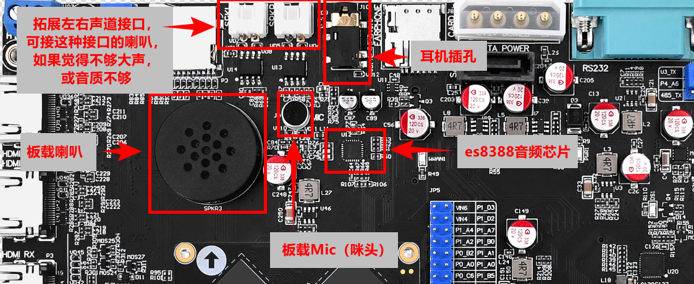
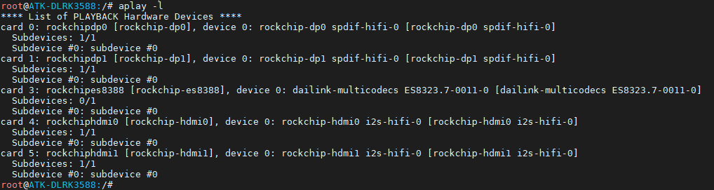
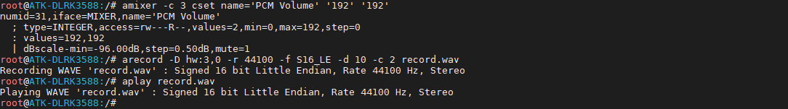
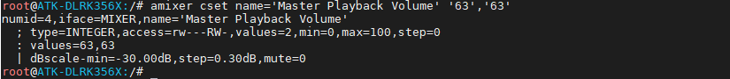
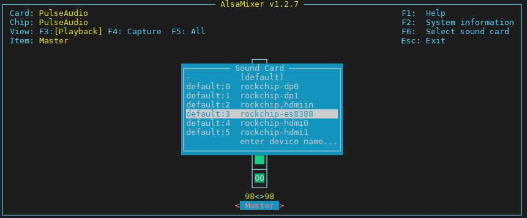

# 3.7 音频测试

&emsp;&emsp;ATR-DLRK3568底板上有CODEC ES8388音频芯片，ES8388是一款高性能、低功耗、低成本的立体声音频编解码器，它由2-chADC、2-chDAC、麦克风放大器、耳机放大器、数字音效和模拟混频和增益功能组成。

&emsp;&emsp;该芯片使用高阶multi-bit delta-sigma调制技术在数字和模拟之间转换数据，使得器件对时钟抖动的灵敏度低，带外噪声低。

<center>

</center>

## 3.7.1 播放音频测试

&emsp;&emsp;使用系统指令aplay或者gst-play-1.0可以播放音频文件。执行下面的指令播放音频文件。用户也可以自己拷贝音频文件到文件系统下使用指令aplay/ gst-play-1.0 + 音频文件播放。

```c#
aplay /usr/share/sounds/test.wav #使用aplay播放音频文件，支持wav，不支持mp3
gst-play-1.0 /opt/ui/src/apps/resource/audio/*mp3 # 使用gst-play-1.0播放，支持wav，支持mp3等
```

## 3.7.2 录音测试

```c#
aplay -l	#这里是-L，小写的L！
```

&emsp;&emsp;查看声卡编号，可以看到es8388是声卡3。下面用到数字3的地方都与这个相关。

<center>

</center>

```c#
amixer -c 3 cset name='PCM Volume' '192' '192'                 # 设置es8388音量，0~192，192最大，默认已经是最大，可不用执行此指令。
arecord -D hw:3,0 -r 44100 -f S16_LE -d 10 -c 2 record.wav     # 开始录音
```

&emsp;&emsp;其他默认不用设置，默认是最大，如需要设置请使用alsamixer然后按F6选择对应的声卡后再设置对应的Item。

&emsp;&emsp;arecord 命令参数解释：<br />
&emsp;&emsp; -c 0：使用声卡0。<br />
&emsp;&emsp; -f S16_LE：以 S16_LE 格式采样。<br />
&emsp;&emsp; -r 44100：采样率 44.1K<br />
&emsp;&emsp; -d 10：录音长度 10s<br />
&emsp;&emsp; -c 2 指定双声道<br />
&emsp;&emsp; record.wav：录音存生成的音频文件

&emsp;&emsp;播放上面录制的音频文件，备注：生成的文件大小与用户设置的格式及录制的长度有关。注，由于录音时设置捕获的音量过高，咪头没有降噪，可能会有杂音，请降低捕获音量（灵敏度）再测试。

&emsp;&emsp;说明：<br />
&emsp;&emsp;如果是使用`开发板光盘B盘-开发环境及SDK->02、ATK-DLRK3588开发板SDK->06、linux_r8_sdk->atk-rk3588_linux_release_R8_v1.0_20250104.tgz` SDK源码编译的Buildroot镜像在播放录音前先执行下面的命令转换录音文件：

```c#
ffmpeg -i record.wav -af "pan=stereo|c0=c0|c1=c0" output.wav
```

&emsp;&emsp;再执行播放录音命令

```c#
aplay record.wav	# 播放录音
```

<center>

</center>

## 3.7.3 音量控制

&emsp;&emsp;输入指令调控音量。

&emsp;&emsp;音量取值范围为0~192。出厂系统默认已经设置最大音量，请注意我们的Qt UI App都是设置的是应用内的软件音量。

```c#
amixer -c 3 cset name='PCM Volume' '192' '192'
```

<center>

</center>

&emsp;&emsp;或者你可以直接使用alsamixer通过图形界面方式调节音量。左右方向键可以选择要调节的项，上下方向键调节音量。若需要控制es83388声卡，请按F6，选择es83388，再设置相关item。

```c#
alsamixer
```

<center>

</center>


