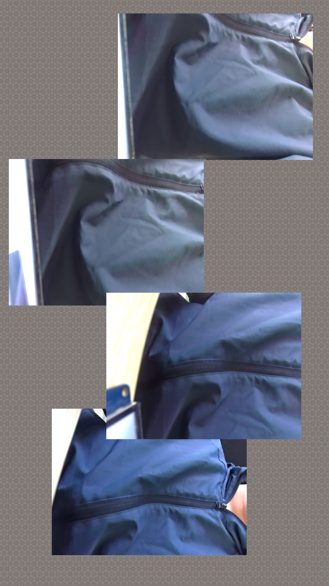

# 3.8 摄像头测试

&emsp;&emsp;ATK-DLRK3588支持MIPI CSI摄像头，正点原子为此开发板配套摄像头目前只支持IMX415（800W像素）。如后续更新支持其他摄像头，请咨询淘宝技术支持。

&emsp;&emsp;请注意，出厂Linux系统默认配置了MIPI CSI1和MIPI CSI3接口。请你将摄像头模块插在中间两个CSI接口中的任意一个接口上。

&emsp;&emsp;在Linux上暂时还不支持4个MIPI摄像头，原因是RK在使用四个摄像头时还有一些BUG，所以我们只配置了两个！但是硬件是支持的，我们在安卓系统上测试过！`请插这两个位置的其中一个，当然如果你有两个摄像头，同时插上都可以的！`


<center>

</center>

&emsp;&emsp;安装方法是摄像头镜头不朝向核心板，请勿插反，及插偏座子，可能会导致烧坏模块，如下图所示。

<center>

</center>

&emsp;&emsp;如果你有MIPI屏幕或者接了显示器，那么你可以点击正点原子开发的Qt相机App。如下图笔者使用MIPI屏幕拍下相机上的图像。效果如下。


<center>

</center>

&emsp;&emsp;默认出厂内核里，其中，摄像头可能是video22节点或者video31节点，看你插在了CSI3还是CSI1。注意，下面指令使用了最大分辨率显示，可能会显示到屏幕之外，请你根据个人屏幕分辨率修改，如1080x1920分辨，对应修改下面的width和height即可，MIPI摄像头是可以取可用分辨率范围内任意取分辨率的，当然有最小范围，具体查看RK源码。比如你可以取1000x1000都可以。

```c#
gst-launch-1.0 v4l2src device=/dev/video22 ! video/x-raw,format=NV12,width=3840,height=2160,framerate=30/1 ! autovideosink
```

新增：<br />
&emsp;&emsp;如果是使用`开发板光盘B盘-开发环境及SDK->02、ATK-DLRK3588开发板SDK->06、linux_r8_sdk->atk-rk3588_linux_release_R8_v1.0_20250104.tgz`，默认是支持同时调用4路IMX415摄像头，开发板上的丝印和/dev/videoX节点的对应关系入下表所示：

| 开发板丝印 | /dev/videoX  |
| :--------: | :----------: |
| MIPI CSI1  | /dev/video62 |
| MIPI CSI2  | /dev/video71 |
| MIPI CSI3  | /dev/video44 |
| MIPI CSI4  | /dev/video53 |


&emsp;&emsp;如果已经同时接好4个IMX415摄像头，可以执行下面的命令进行测试（不要直接复制）：

```c#
gst-launch-1.0 \
v4l2src device=/dev/video44 ! video/x-raw,format=NV12,width=640,height=480,framerate=30/1 ! videoconvert ! autovideosink sync=false \
v4l2src device=/dev/video62 ! video/x-raw,format=NV12,width=640,height=480,framerate=30/1 ! videoconvert ! autovideosink sync=false \
v4l2src device=/dev/video53 ! video/x-raw,format=NV12,width=640,height=480,framerate=30/1 ! videoconvert ! autovideosink sync=false \
v4l2src device=/dev/video71 ! video/x-raw,format=NV12,width=640,height=480,framerate=30/1 ! videoconvert ! autovideosink sync=false
```

&emsp;&emsp;命令的正确格式如下图

<center>

</center>


&emsp;&emsp;测试结果如下图所示

<center>

</center>


