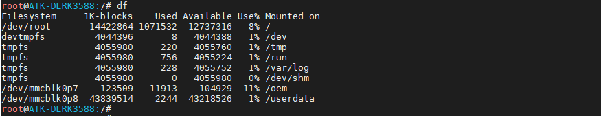

# 4.1 挂载点信息

&emsp;&emsp;系统启动后，挂载点如下。

&emsp;&emsp;其中重要的挂载点如下： 
&emsp;&emsp;/：根目录，这里就是我们常见的根目录，里面有/dev/、/usr/lib等等常见文件夹/文件。 
&emsp;&emsp;/oem：厂商文件夹，存放着厂商提供的测试文件/程序 
&emsp;&emsp;/userdata：用户数据文件夹，建议用户保存数据到此目录，因为此文件夹空间比“/”根目录空间大。将来用户做产品时，也建议将App产生的数据保存到这个文件夹下，防止塞满根分区影响启动。

