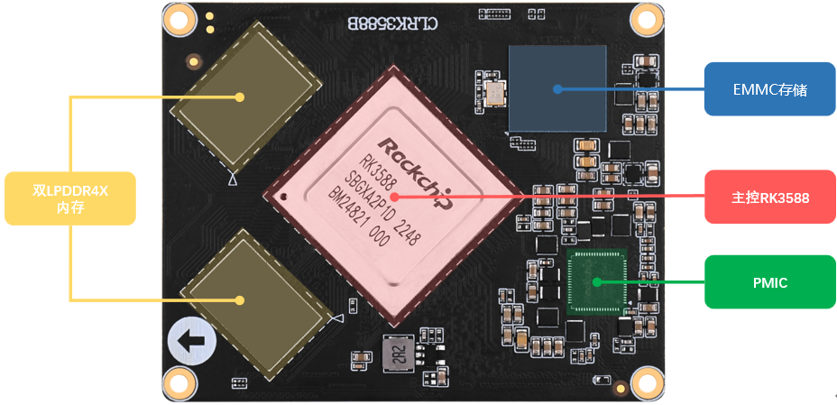
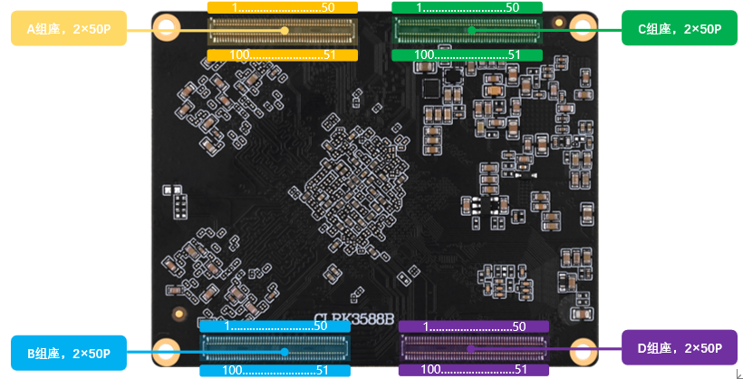

# 2.1 核心板硬件参数

|   **参数项**   |            **参数**            | **备注**                                                     |
| :------------: | :----------------------------: | :----------------------------------------------------------- |
|    尺寸规格    |           68mm*54mm            | 长*宽                                                        |
|      CPU       |        Rockchip RK3588         | BGA1088封装                                                  |
|      内存      |       4/8/16 GB LPDDR4X        | 贴片封装。受芯片供货影响，可能会有多种不同厂家的芯片，一切以实际贴片的型号为准。 |
|      存储      |          32/64/128 GB          | 贴片封装。受芯片供货影响，可能会有多种不同厂家的芯片，一切以实际贴片的型号为准。 |
|  电源管理芯片  |            RK806-1             |                                                              |
| 工作电压（1）  |        一路电压输入4.0V        |                                                              |
|   功耗（2）    |             ≥1.8W              | 静态功耗，具体功耗取决于外设                                 |
|    运行温度    |        商业级0℃ ～ +70℃        |                                                              |
|     引脚数     |             400Pin             |                                                              |
|    引脚间距    |             0.4mm              | 核心板引脚中心间距                                           |
| 核心板连接方式 |          板对板(BTB)           | 连接器：DF40C-100DS-04V(51)                                  |
|    PCB工艺     | 10层，沉金工艺，独立接地信号层 | 采用无铅工艺                                                 |

&emsp;&emsp;注： （1）核心板的功耗数据是由环境12V/2.5A输入，只接串口UART2，不接其他外设。具体功耗数据取决于开发板所接的外设。

 
图 2.1.1核心板正面资源

 
图 2.1.2核心板引脚说明

