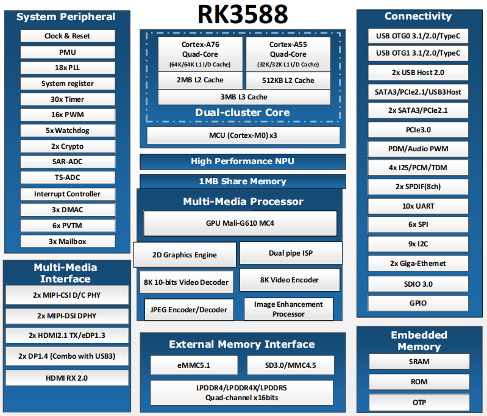

# 2.2 RK3588芯片参数

 
图 2.2.1 芯片资源

&emsp;&emsp;RK3588芯片主要资源：

|    处理器    | 四核Cortex-A76 +四核Cortex-A55                               |
| :----------: | :----------------------------------------------------------- |
|     GPU      | ARM GPU(Mali-G610 MC4)，支持OpenGL ES1.1/2.0/3.1/3.2、OpenCL1.1/1.2/2.0和Vulkan 1.1/1.2，内嵌高性能2D图像加速器模块和图像增强处理器。 |
|     NPU      | 6.0 TOPS 算力，三核架构，支持int4/int8/int16/FP16/BF16/TF32  |
|     ISP      | 2×ISP(ISP0/ISP1)，支持HDR、2DNR、3DHR 支持48M：8064×6048@15fps 支持32M：6528×4898@30fps 支持16M：4672×3504@30fps |
|  视频解码器  | ◼ H.264、VP9：8K@30fps (7680x4320) ◼ H.265、AVS2：8K@60fps (7680x4320) ◼ AV1 : 4K@60fps (3840x2160) |
|  视频编码器  | ◼ H.264、H.265：8K@30fps                                     |
|  JPEG解码器  | 最大支持35535×65535 支持YUV400/YUV411/YUV420/YUV422/YUV440/YUV444 最高1080P@280fps，每秒5.6亿像素 |
|  JPEG编码器  | 最大支持8192x8192(67Mpixels) 最高每秒九千万像素         |
| 视频输入接口 | 支持两个MIPI DC(DPHY/CPHY)组合 每个MIPI DPHY V1.2，4通道，每通道最高2.5Gbps 每个MIPI CPHY V1.1，3通道，每通道最高2.5Gbps |
| 视频输入接口 | 支持四个MIPI CSI DPHY 每个MIPI DPHY V1.2，2通道，每通道最高2.5Gbps 支持2个DPHY组成一个4通道 |
| 视频输入接口 | 支持MIPI摄像头组合 2个MIPI DCPHY + 4个MPIPI CSI DPHY(2通道)，共6个摄像头输入 2个MIPI DCPHY + 1个MIPI CSI DPHY(2通道)，共5个摄像头输入 2个MIPI DCPHY + 2个MIPI CSI DPHY(4通道)，共4个摄像头输入 |
| 视频输入接口 | 支持DVP接口 8/10/12/16-bit标准DVP接口，最高150MHz数据输入 支持BT.601/BT.605和BT.1120 VI接口 |
| 视频输入接口 | 支持HDMI RX接口 HDMI 2.0模式：3.4Gbps~6Gbps HDMI 1.4模式：250Mbps~3.4Gbps 支持HDCP2.3和HDCP1.4 |
| 显示输出接口 | 支持 HDMI/EDP TX 支持2个HDMI/EDP TX组合接口，但是两者不能同时工作 HDMI TX支持7680×4320@60Hz分辨率，支持3，6，8，10和12Gbps带宽，支持HDCP2.3 EDP TX支持4K@60Hz分辨率，支持1.62Gbps，2.7Gbps和5.4Gbps带宽，支持HDCP1.3 |
| 显示输出接口 | 支持DP TX                                                    |
| 显示输出接口 | 支持2个DP TX 1.4a接口，可连接USB3.1 Gen1 每个接口支持1/2/4通道 支持7680×4320@30Hz分辨率 支持HDCP2.3和HDCP1.3 |
| 显示输出接口 | 支持MIPI DSI 支持2个MIPI DPHY 2.0或CPHY 1.1接口 DPHY支持4个数据通道，每通道最大数据速率为4.5Gbps CPHY支持3个数据通道，每通道最大数据速率为2.0Gbps 支持最高4K@60Hz分辨率 |
| 显示输出接口 | 支持BT.1120输出 支持RGB格式(最高8bit)，数据速度最高150MHz 支持最高1920×1080@60Hz |
|   音频接口   | 支持8lanes I2S0/I2S1，2lanes I2S2/I2S3 支持TX和RX，音频分辨率16~32位，采样率最高为192KHz |
|   音频接口   | 支持SPDIF0/SPDIF1 支持2×16bit音频数据存储 支持16/20/24位线性PCM传输和非线性PCM传输 |
|   音频接口   | 支持PDM0/PDM1 音频分辨率为16~24位，采样率最高为192KHz   |
|   SDIO接口   | 兼容SDIO 3.0协议 4-bit 数据总线宽度                     |
| Ethernet接口 | 支持两个GMAC，10/100/1000M数据传输速率 支持RGMII/RMII接口引出 支持全双工或半双工 |
| USB 3.1 Gen1 | 支持USB3.1 Gen1，相当于USB3.2和USB3.0，数据速率最高5Gbps 2路USB3.1 OTG，与DP TX(USB3OTG_0和USB3OTG_1)复用 1路USB3.1 HOST，与PIPE PHY2(USB3OTG_2)复用 |
| USB 2.0 HOST | 支持两路USB2.0 HOST 支持高速(480Mbps)，全速(12Mbps)，低速(1.5Mbps)模式 |
| PCIE 2.1接口 | 3个PCIE 2.1控制器，与SATA3.0和USB3.1控制器复用 每个PCIE 2.1接口支持1 lane |
|   SATA接口   | 3个SATA控制器，与PCIE 2.1和USB3.1控制器复用 每个SATA接口支持一个端口，最高6Gbps数据速率 |
| PCIE 3.0接口 | 支持4路PCIED 3.0 最高支持数据速率为8Gbps 支持4种组合方式：1×4 lanes、2×2 lanes、4×1 lanes、1×2 lanes + 2×1 lanes |
|     SPI      | 5个SPI控制器 每个控制器支持两路片选输出 支持串行主，串行从模式，软件可配置 |
|     I2C      | 9个I2C主控制器 支持7位和10位地址模式 快速模式下数据传输速率为400K bits/s |
|     UART     | 10个UART接口 内置2路64 bit FIFO，支持TX和RX传输 波特率最高为4Mbps 支持自动流控模式 |
|     CAN      | 3个CAN总线 支持 CAN 2.0B协议                            |
|     PWM      | 16个片上PWM 其中PWM3、PWM7、PWM11、PWM15可用于红外应用  |
|     ADC      | 8个SARADC 支持12 bit分辨率，采样率高达1MS/S             |
|     封装     | FCBGA1088L                                                   |

&emsp;&emsp;注意：这里是芯片数据手册资源参数值，非核心板可用资源参数值。笔者这里大致写出外设属性，更多详细信息可以参考一下RK3588的数据手册。

