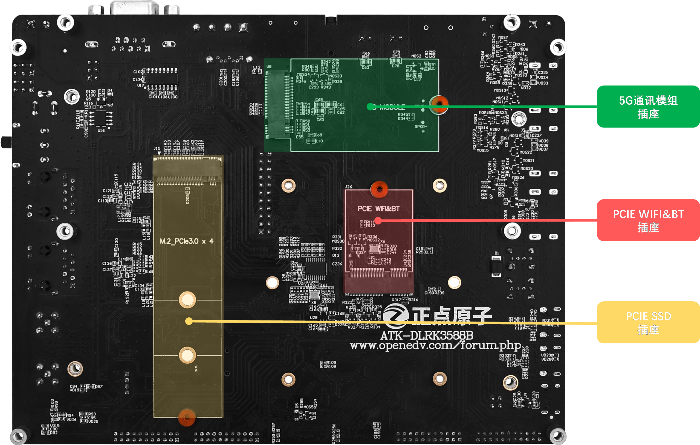

# 1.1 ATK-DLRK3588B开发板底板资源

&emsp;&emsp;首先，我们来一下ATK-DLRK3588B开发板的底板正反面资源图，如图1.1.1和1.1.2所示：

 
图1.1.1 ATK-DLRK3588BB开发板底板正面资源图

 
图1.1.2 ATK-DLRK3588B开发板底板反面资源图

&emsp;&emsp;从上图可以看出，ATK-DLRK3588B开发板底板资源十分丰富，扩充了丰富的接口和功能模块，基本将RK3588的资源都已经引出来了。开发板的外形尺寸为180mm*140mm大小，板子的设计充分考虑了人性化设计，便于开发使用。

&emsp;&emsp;正点原子ATK-DLRK3588B开发板底板板载资源如下： 
&emsp;&emsp;◆	底板采用4层沉金设计 
&emsp;&emsp;◆	1组核心板连接座接口，支持ATK-CLRK3588B核心板 
&emsp;&emsp;◆	1个状态指示灯（绿色，用户可以使用） 
&emsp;&emsp;◆	1个电源指示灯（蓝色） 
&emsp;&emsp;◆	1路DC12V电源输入接口 
&emsp;&emsp;◆	1个电源开关，控制整板电源 
&emsp;&emsp;◆	2路10M/100M/1000M以太网接口（RJ45） 
&emsp;&emsp;◆	1组2×11P 2.54mm间距的排针，引出20个IO+2个ADC输入引脚，用户可自行使用 
&emsp;&emsp;◆	1路WIFI天线接口 
&emsp;&emsp;◆	1路BT天线接口 
&emsp;&emsp;◆	1个USB WIFI&BT模块 
&emsp;&emsp;◆	1个六轴传感器，三轴陀螺仪，三轴加速度计 
&emsp;&emsp;◆	3个功能按键，用于系统烧写控制，复位等功能 
&emsp;&emsp;◆	4个用户按键，用户可自行使用 
&emsp;&emsp;◆	1个4P的散热风扇接口 
&emsp;&emsp;◆	1个RTC纽扣电池座 
&emsp;&emsp;◆	1个RTC芯片，采用AT8563或PCF8563芯片，以实际焊接芯片型号为准 
&emsp;&emsp;◆	2个MIPI DSI屏幕接口，4 lanes 
&emsp;&emsp;◆	4个MIPI CSI摄像头接口，4 lanes 
&emsp;&emsp;◆	1个USB串口，可用于代码调试，Type-C接口类型 
&emsp;&emsp;◆	2个USB 3.1 Type-C接口，具有OTG功能，可进行USB从机通信，主要用于固件烧写。同时这两个USB Type-C接口也支持DP显示功能。 
&emsp;&emsp;◆	2个DP显示接口，注意：2个DP接口与上面的USB 3.1 Type-C接口复用，使用Type-C转DP线即可连接DP显示器。 
&emsp;&emsp;◆	2个USB2.0 HOST接口 
&emsp;&emsp;◆	1个HDMI接收接口，可以接收其他设备输出的HDMI信号 
&emsp;&emsp;◆	2个HDMI发送接口，可以连接HDMI显示器 
&emsp;&emsp;◆	1个板载小扬声器 
&emsp;&emsp;◆	1个CAN接口 
&emsp;&emsp;◆	1个可调电位器，用于ADC测试 
&emsp;&emsp;◆	1个TF卡接口 
&emsp;&emsp;◆	2个小喇叭接口，支持左右双声道 
&emsp;&emsp;◆	1个录音头（MIC/咪头） 
&emsp;&emsp;◆	1个耳机接口 
&emsp;&emsp;◆	1个Nano SIM卡接口 
&emsp;&emsp;◆	1个SATA电源接口 
&emsp;&emsp;◆	1个SATA机械硬盘接口 
&emsp;&emsp;◆	1个RS232接口 
&emsp;&emsp;◆	1个RS485接口 
&emsp;&emsp;◆	1组5V电源供应/接入口 
&emsp;&emsp;◆	1组3.3V电源供应/接入口 
&emsp;&emsp;◆	1个5G模组接口 
&emsp;&emsp;◆	1个PCIE WIFI&BT模组接口 
&emsp;&emsp;◆	1个M.2接口的SSD接口，可以连接SSD固态硬盘 

&emsp;&emsp;正点原子ATK-DLRK3588B开发板底板的特点包括： 
&emsp;&emsp;1)、接口丰富。开发板提供十来种标准接口，可以方便地进行各种外设的实验和开发。 
&emsp;&emsp;2)、设计灵活。采用核心板+底板形式，板上很多资源都可以灵活配置，以满足不同条件下的使用。核心板引出了RK3588所有通信接口，包含UART、I2C、SPI、CAN、SDMMC、USB、MIPI-DSI、MIPI-CSI、ADC、HDMI、AUDIO、SATA、PCIE、千兆以太网等，极大地方便大家扩展及使用。  
&emsp;&emsp;3)、资源丰富。板载高性能音频编解码芯片、千兆网卡、六轴传感器以及各种接口芯片，满足多种应用需求。 
&emsp;&emsp;4)、人性化设计。各个接口都有丝印标注，使用起来一目了然；部分常用外设大丝印标出，方便查找；接口位置设计合理，方便使用。  

