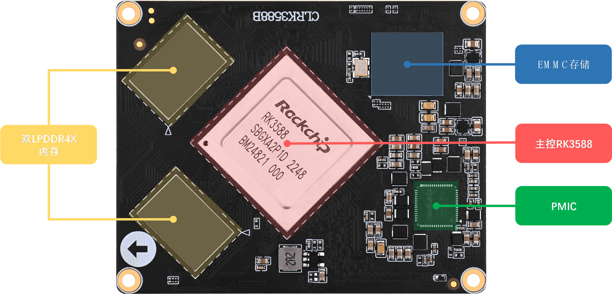
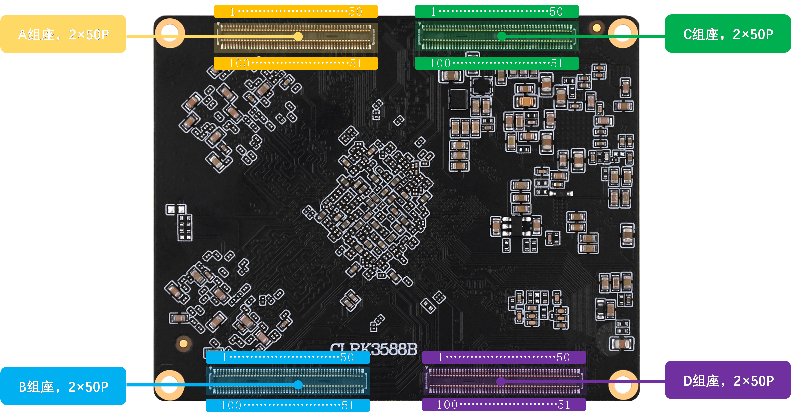

# 1.2 ATK-CLRK3588B核心板资源

&emsp;&emsp;ATK-DLRK3588B开发板所使用的核心板型号为ATK-CLRK3588B。接下来，我们来看ATK-CLRK3588B核心板正反面资源图，如图1.2.1和1.2.2所示：

 
图1.2.1 ATK-CLRK3588B核心板正面

 
图1.2.2 ATK-CLRK3588B核心板背面

&emsp;&emsp;整个核心板的外形尺寸为68mm*54mm大小，采用了0.4mm间距贴片板对板连接器，和底板BTB连接座的合高为1.5mm，可以很方便地应用在各种项目上。

&emsp;&emsp;正点原子ATK-CLRK3588B核心板板载资源如下： 
&emsp;&emsp;◆	核心板采用10层沉金设计。 
&emsp;&emsp;◆	CPU：采用瑞芯微RK3588 八核旗舰处理器，4核Cortex-A76+4核Cortex-A55，主频最高可达2.4GHz(RK3588芯片工艺问题，最高工作主频以所使用的芯片实际主频为准)。内置Mali-G610 MC4，能够提供强大图像处理性能。支持OpenGL ES 1.1/2.0/3.1/3.2、Vulkan 1.1/1.2、OpenCL 1.1/1.2/2.0，内置高性能2D图像加速器。内置6TOPs 三核NPU，支持INT4/INT8/INT16/FP16/BF16/TF32。内置H.265/H.264/AV1/VP9/AVS2视频解码器，最高支持8K@60FPS解码。内置H.264/H.265视频编码器，最高支持8K@30FPS编码。支持eDP/DP/ HDMI2.1/MIPI 等多种显示接口，支持多屏异显。内置最高48MP ISP，支持HDR 和3DNR，支持多摄像头输入。 
&emsp;&emsp;◆	外扩2片LPDDR4X，内存容量为4/8/16GB可选。 
&emsp;&emsp;◆	32/64/128GB EMMC存储芯片。 
&emsp;&emsp;◆	4组2×50P连接座，总共400个脚。共引出122个GPIO(可复用为其他功能)、173个其他功能引脚(HDMI、PCIE、USB、MIPI屏幕，MIPI摄像头、ADC、SATA等)、9个电源引脚(给核心板供电引脚以及核心板PMIC输出电源引脚，不包含GND)。 

&emsp;&emsp;正点原子ATK-CLRK3588B核心板的特点包括： 
&emsp;&emsp;1)、体积相对小巧。核心板仅68mm*54mm大小，方便使用到各种项目里面。 
&emsp;&emsp;2)、集成方便。核心板使用4个2*50P BTB连接座，可以非常方便地集成到客户PCB上，更换简单，方便维修测试。 
&emsp;&emsp;3)、资源丰富。核心板板载：4/8/16GB LDDR4X内存、32/64/128GB EMMC存储器，可以满足各种应用需求。 
&emsp;&emsp;4)、性能稳定。核心板采用10层板沉金设计，单独地层、电源层，且关键信号采用等长线走线，阻抗匹配，保证运行稳定、可靠。 
&emsp;&emsp;5)、人性化设计。底部放有详细丝印，方便安装；按功能分区引出IO口，方便布线。 

