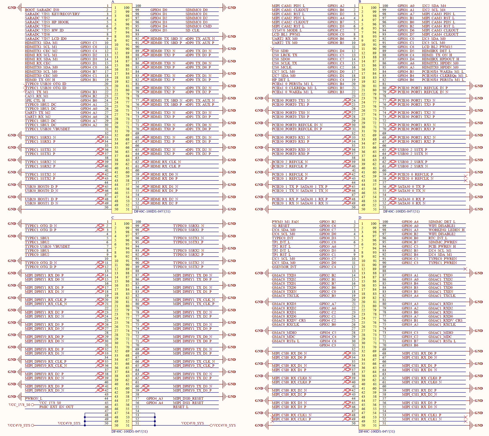
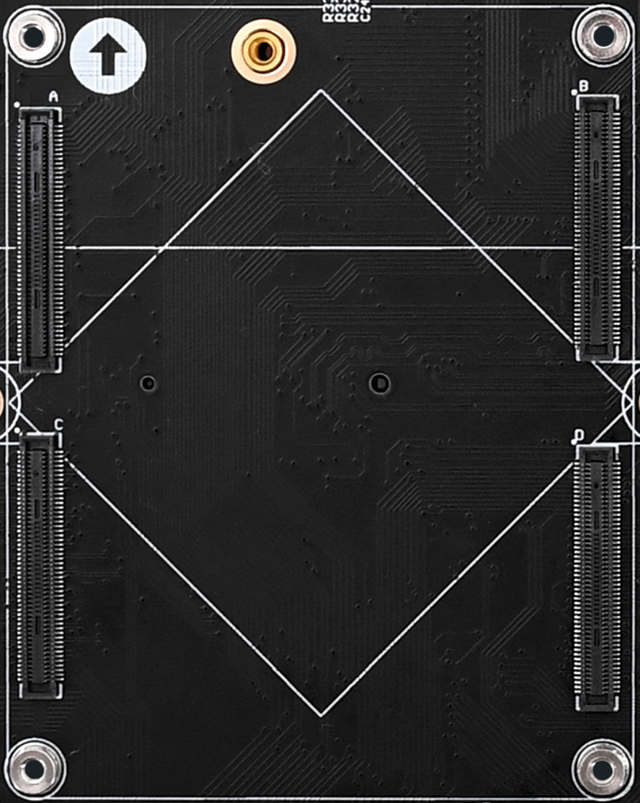

# 3.1 核心板接口

&emsp;&emsp;开发板采用底板+核心板的形式。开发板底板采用4个2*50的板对板连接器来与核心板连接，接插非常方便，底板上面的核心板接口定义如图3.1.1所示：

 
图3.1.1 底板对接核心板连接座定义

&emsp;&emsp;图中的A、B、C和D就是底板上的连接座接口，由4个2*50PIN的板对板母座组成，包含122个GPIO、173个其他功能引脚、94个GND引脚、9个电源引脚和2个悬空引脚，组成400PIN。

 
图3.1.2 底板转接板接口实物图

&emsp;&emsp;用户在设计底板时，需注意连接座的定义顺序，不要接反了方向。比如，原理图图中C47 ~C54引脚是8个VCC4V0_SYS电源输入引脚，给核心供电。用户在插拔核心板时，需注意底板图中箭头标记方向与核心板的箭头标记方向保持一致，才能对插成功，另外不能太强力拆卸，否则可能会损坏连接座。
