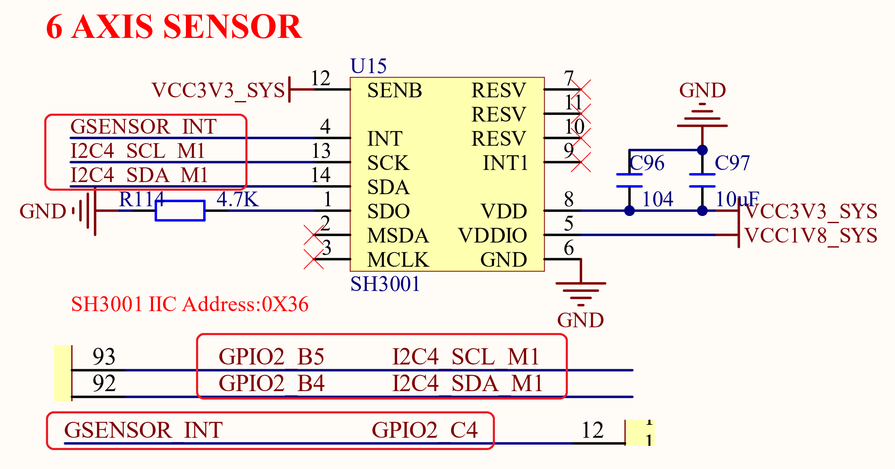

# 3.10  六轴传感器

&emsp;&emsp;ATK-DLRK3588B开发板板载了一个六轴传感器，电路如图3.10.1所示：

 
图3.10.1 六轴传感器

&emsp;&emsp;六轴传感器芯片型号为：SH3001，该芯片内部集成了：三轴加速度传感器和三轴陀螺仪，这里我们使用I2C接口来访问。使用RK3588的I2C4来连接SH3001，I2C4_SCL_M1和I2C4_SDA_M1分别连接到RK3588的GPIO2_B5和GPIO2_B4这两个引脚。GSENSOR_INT是SH3001的中断引脚，连接到RK3588的GPIO2_C4引脚上。

