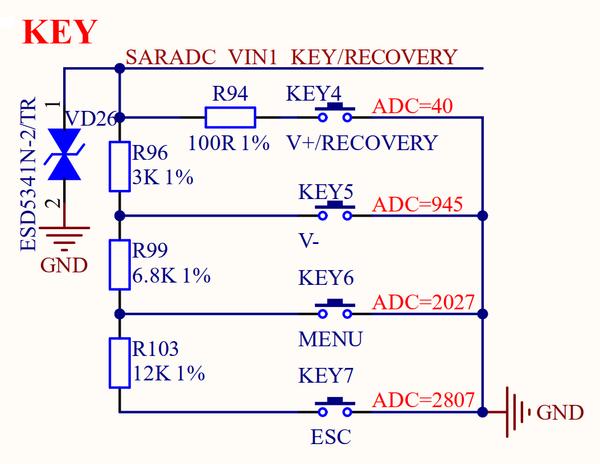

# 3.11 用户按键

&emsp;&emsp;正点原子ATK-DLRK3588B开发板板载4个输入按键，其原理图如图3.11.1所示：

 
图3.11.1 用户按键

&emsp;&emsp;从图3.11.1可以看出，一共有4个用户按键，但是这4个用户按键都是通过一个ADC通道实现的。按下不同按键的时候所采集到的ADC值不同，这样就区分出了哪个按键被按下。使用ADC来采集按键值，可以节省IO，否则4个按键我们就需要4个IO来采集。不方便的地方就是需要先使用ADC来读取电压值，根据电压值的不同判断哪个按键被按下。如果使用GPIO来直接连接按键，只需要判断GPIO的高低电平即可得到具体按键的按下与释放情况。

