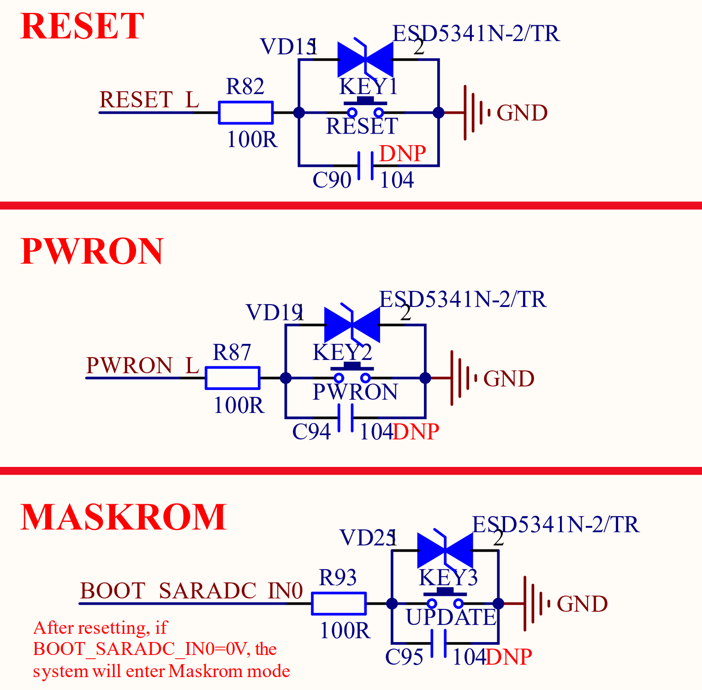

# 3.12 功能按键 

&emsp;&emsp;正点原子ATK-DLRK3588B开发板板载3个功能按键，其原理图如图3.12.1所示：

 
图3.12.1 功能按键

&emsp;&emsp;从图3.12.1可以看出，一共有3个功能按键：RESET、PWRON和UPDATE(最下面的MASKROM模式按键)。RESET是复位按键，低电平复位，当RESET按键按下以后会复位整个开发板。PWRON按键是核心板上RK806-1这个PMIC的PWRON按键，如果核心板不正常， 即使按RESET按键进行复位也不能解决，这个时候就可以按下PWRON按键。UPDATE按键用于系统升级、更新使用

