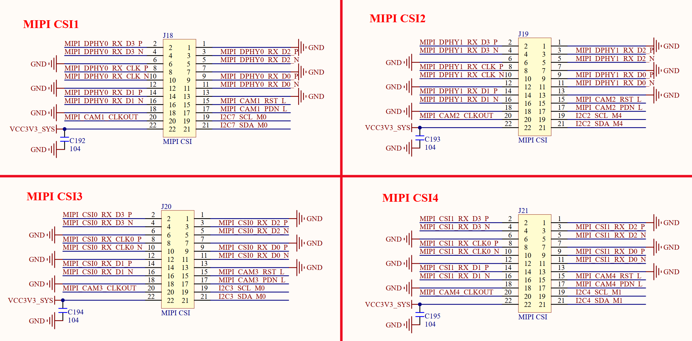

# 3.13 MIPI摄像头接口

&emsp;&emsp;正点原子ATK-DLRK3588B开发板板载了4个MIPI摄像头接口，其原理图如图3.13.1所示：

 
图3.13.1 摄像头模块接口

&emsp;&emsp;图中J18、J19、J20和J21是4路MIPI摄像头接口，全部为2*11P 2.0mm的排座，可以用来连接正点原子MIPI摄像头模块，支持4 Lanes。注意，这个MIPI摄像头模块虽然是3.3V供电的，但是所有信号引脚电压是1.8V的，如果要使用自己的MIPI摄像头，一定要注意摄像头模块的引脚电压要为1.8V。

