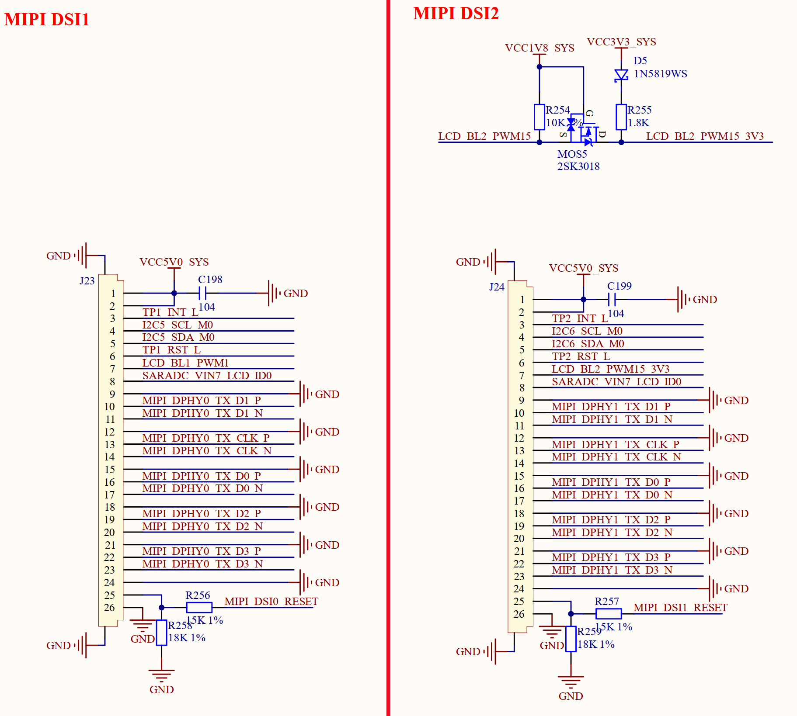

# 3.15 MIPI屏接口

&emsp;&emsp;ATK-DLRK3588B开发板有2个MIPI屏幕接口，原理图如图3.15.1所示：

 
图3.15.1 MIPI屏幕接口

&emsp;&emsp;图3.15.1中，J23和J24就是2路MIPI 屏幕接口，全部为26P 0.5mm FPC座，采用4 Lanes格式，并支持电容触摸屏。这2路接口仅支持MIPI接口的液晶，目前正点原子的MIPI接口屏幕模块有：5.5寸720P(1280*720)、5.5寸1080P(1920*1080)和10.1寸(800*1280)三种，我们分别来看一下这2路MIPI接口：

&emsp;&emsp;**MIPI DSI1：**

&emsp;&emsp;图中的I2C5_SCL_M0和I2C5_SDA_M0为I2C5的两根数据线，分别连接到RK3588的GPIO3_C7和GPIO3_D0这两个IO上。LCD_BL1_PWM1是LCD的背光控制IO，连接在RK3588的GPIO0_C0上，用于控制LCD的背光。TP1_RST_L是触摸屏的复位信号，连接到RK3588的GPIO3_C1引脚上。TP1_INT_L是触摸屏的中断信号，连接到RK3588的GPIO3_C0引脚上。MIPI_DSI0_RESET是MIPI屏幕的复位引脚，连接到RK3588的GPIO4_A3引脚上。

&emsp;&emsp;**MIPI DSI2：**

&emsp;&emsp;图中的I2C6_SCL_M0和I2C6_SDA_M0为I2C6的两根数据线，分别连接到RK3588的GPIO0_C7和GPIO0_D0这两个IO上。LCD_BL2_PWM15_3V3是LCD的背光控制IO，连接在RK3588的GPIO1_C6上，用于控制LCD的背光。由于正点原子RK3588开发板GPIO1_C6是1.8V的IO，所以需要经过电平转换电路转为3.3V，MOS5这个2SK3018就是完成电平转换的。TP2_RST_L是触摸屏的复位信号，连接到RK3588的GPIO3_A6引脚上。TP2_INT_L是触摸屏的中断信号，连接到RK3588的GPIO3_D5引脚上。MIPI_DSI1_RESET是MIPI屏幕的复位引脚，连接到RK3588的GPIO4_A4引脚上。

&emsp;&emsp;注意，图中MIPI部分的引脚工作电压为1.8V，触摸屏相关引脚工作电压为3.3V，背光引脚工作电压为3.3V。

