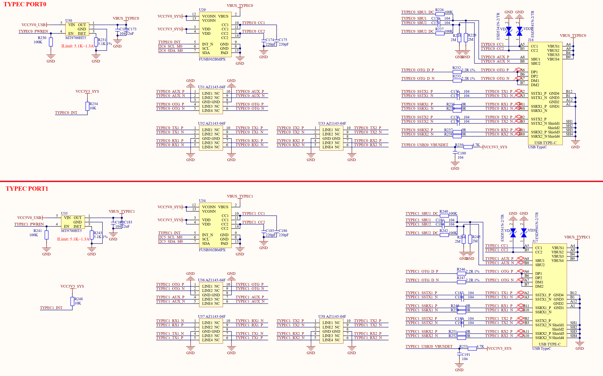

# 3.17 USB OTG(Type-C)接口

&emsp;&emsp;正点原子ATK-DLRK3588B开发板也有2路USB Type-C OTG接口，连接到了RK3588的2个Type-C接口上，这两路USB接口原理图如图3.17.1所示：

 
图3.17.1 2路USB Type-C OTG接口

&emsp;&emsp;这2路USB Type-C OTG既可以做从机，也可以做主机，而且也支持DP显示功能。图3.17.1中的J16和J17就是开发板的USB Type-C接口，用于连接外部设备。其中正点原子出厂系统默认设置J16这个Type-C口用于系统烧写和ADB调试！

