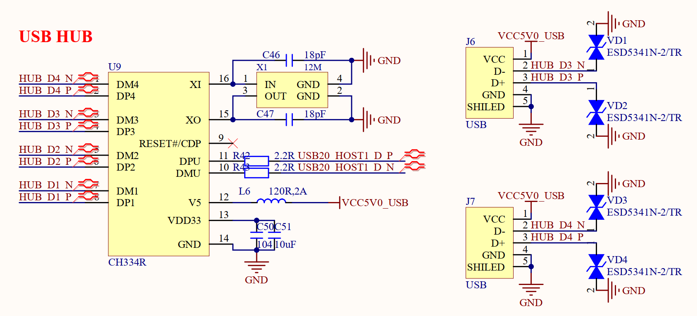

# 3.19 USB2.0 HUB接口

&emsp;&emsp;开发板板载一颗一扩四的USB HUB芯片，用于将处理器RK3588的USB20_HOST1扩展为4路USB HOST接口(其中1路连接5G模块，1路连接PCIE WIFI&BT接口，剩余2路以HOST形式留出来，用来外接其他USB设备)，原理图如下图3.19.1所示：

 
图3.19.1 USB2.0 HUB电路

&emsp;&emsp;图3.19.1中开发板通过CH334R芯片将RK3588的USB20_HOST1外扩出4路USB HOST接口，其中1路外接了5G模块，1路连接PCIE WIFI&BT接口，因此提供给用户的有2路USB HOST接口，分别是图3.19.1中的J6和J7这两个接口，可以通过这两个接口外接U盘、鼠标键盘等USB外设。
