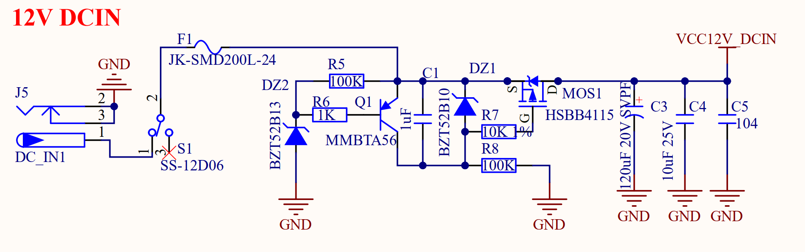

# 3.2 电源

&emsp;&emsp;ATK-DLRK3588B开发板板载的电源供电部分，其原理图如图3.2.1~3.2.5所示：

 
图3.2.1 12V输入电源

 
图3.2.2 4V核心板电源

 
图3.2.3 3.3V电源

 
图3.2.4 5V电源

 
图3.2.5 1.8V电源

&emsp;&emsp;图3.2.1是整个开发板的12V直流电源输入接口，具有防反接和12V稳压功能，由于RK3588性能强大，因此功耗比较高。所以所使用的12V电源功率要大，正点原子ATK-DLRK3588B开发板默认配备了一个12V 2.5A电源的适配器，基本能够满足RK3588的需求。如果大家在使用的时候，需要电源提供更高的功率，请自行另外配置供电能力更好的12V直流电源。

&emsp;&emsp;图3.2.2是给核心板供电的4V电源，输入的12V直流电源经过DC-DC芯片U1（MP8759）转换为4V电源输出，这个4V电源输入给核心板。

&emsp;&emsp;图3.2.3是开发板的3.3V电源，将输入的12V电源经过DC-DC芯片U2（SCT2230）转换为3.3V输出，这个3.3V就是整个底板的3.3V电源。

&emsp;&emsp;图3.2.4是开发板底板的两个5V电源，通过DC-DC芯片U6(SCT2230)和U7(SCT2230)转换出来2路5V电源，其中一路（VCC5V0_USB）给USB使用，另外一路（VCC5V0_SYS）供底板上其他5V外设使用。

&emsp;&emsp;图3.2.5是开发板的1.8V电源，将输入的VCC5V0_SYS电源经过DC-DC芯片U3（SCT2230）转换为1.8V输出，作为底板的1.8V外设所使用的电源。

