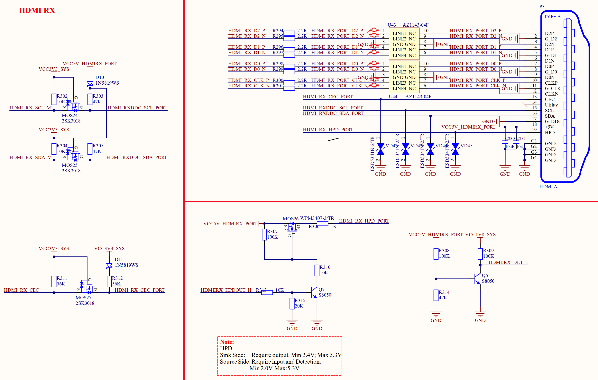

# 3.20 HDMI RX接口

&emsp;&emsp;ATK-DLRK3588B开发板板载一个HDMI RX接口，可以用来接收其他设备发送过来的HDMI信号，HDMI RX接口原理图如图3.20.1所示：

 
图3.20.1 HDMI RX原理图

&emsp;&emsp;由于RK3588原生支持HDMI RX接口，所以HDMI RX的原理图就比较简单，P3为标准的HDMI插座。其他设备输出的HDMI信号接入此接口即可。此HDMI RX接口支持HDMI 2.0和1.4b，最高支持2160p@60Hz。
