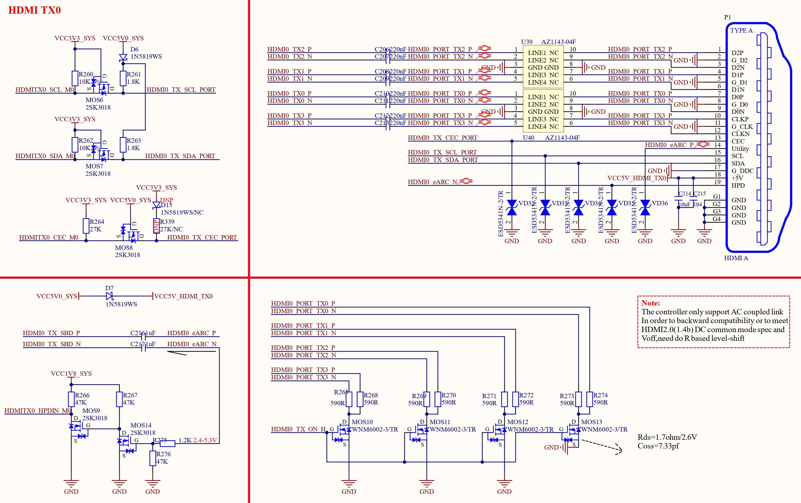
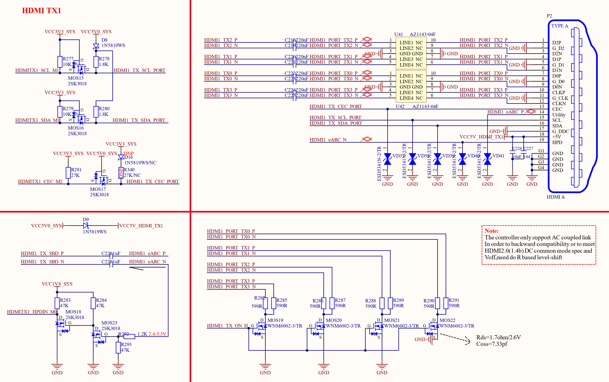

# 3.21 2路HDMI TX接口

&emsp;&emsp;ATK-DLRK3588B开发板板载2个HDMI TX接口，原理图如图3.21.1和3.21.2所示：

 
图3.21.1 HDMI TX0原理图

 
图3.21.2 HDMI TX1原理图

&emsp;&emsp;RK3588有两个原生的HDMI TX接口，可以连接两个HDMI显示器或电视。图3.21.1和3.21.2就是这两个HDMI TX接口。两个HDMI接口功能相同，最高支持7680×4320@60Hz。
