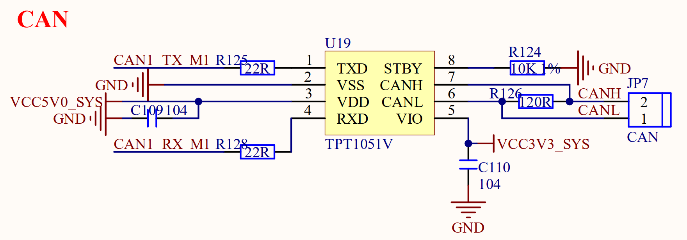

# 3.23 CAN接口

&emsp;&emsp;ATK-DLRK3588B开发板板载1路CAN接口电路如图3.23.1所示：

 
图3.23.1 CAN接口电路

&emsp;&emsp;CAN总线电平不能直接连接到RK3588对应引脚上，这里我们使用TPT1051V来做CAN电平转换，其中R126为终端匹配电阻。

&emsp;&emsp;CAN1_RX_M1/CAN1_TX_M1直接连接在RK3588的GPIO4_B2和GPIO4_B3上面。

