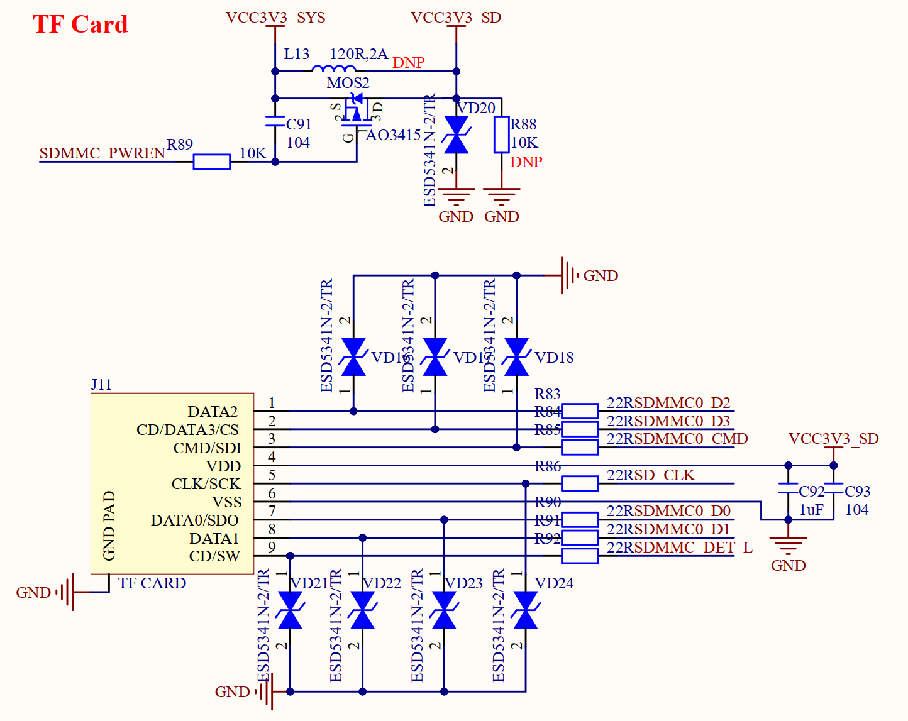

# 3.25 TF卡接口

&emsp;&emsp;正点原子ATK-DLRK3588B开发板板载了一个TF卡（小卡）接口，其原理图如图3.25.1所示：

 
图3.25.1 TF卡接口

&emsp;&emsp;图中J11的TF_CARD为TF卡接口，TF卡采用4位SDMMC方式驱动，非常适合需要高速存储的情况。图中：SDMMC0_D0~D3/SD_CLK/SDMMC0_CMD分别连接在RK3588的GPIO4_D0、GPIO4_D1、GPIO4_D2、GPIO4_D3、GPIO4_D5和GPIO4_D4引脚上。 SDMMC_DET是TF卡检测引脚，用于检测TF卡插拔过程，连接到RK3588的GPIO0_A4引脚上。

&emsp;&emsp;另外，图中TF卡电源通过SDMMC_PWREN这个引脚来控制，此引脚连接到RK3588的GPIO0_B7引脚上。
