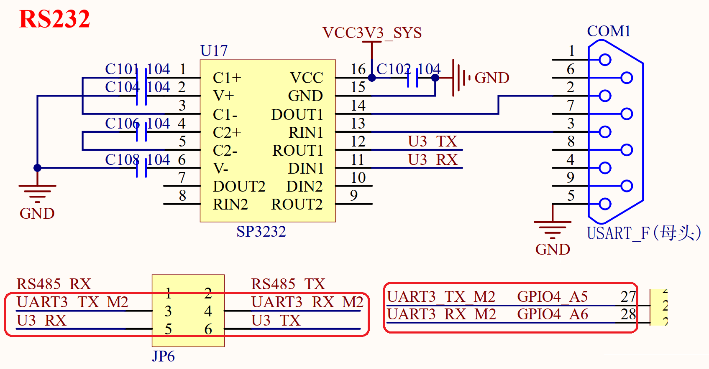

# 3.28 RS232接口

&emsp;&emsp;RK3588开发板板载了1个RS232接口，为母头，电路原理图如图3.28.1所示：

 
图3.28.1 RS232串口

&emsp;&emsp;因为RS232电平不能直接连接到RK3588，所以需要一个电平转换芯片。这里我们选择的是SP3232（也可以用MAX3232）来做电平转接。在使用的时候需要将JP6跳线帽接起来，U3_RX接UART3_TX_M2，U3_TX接UART3_RX_M2，所以RS232串口使用的是RK3588的串口3。
