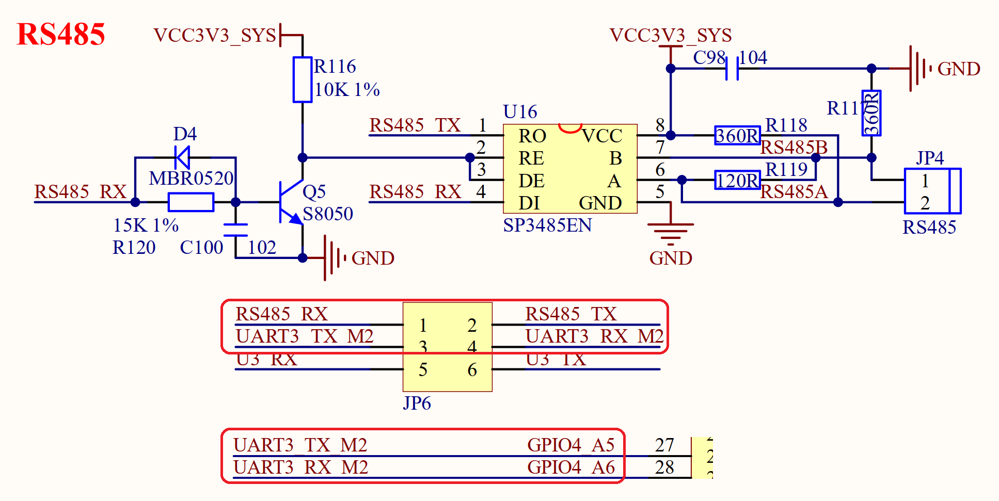

# 3.29 RS485接口

&emsp;&emsp;ATK-DLRK3588B开发板板载的RS485接口电路如图3.29.1所示：

 
图3.29.1 RS485接口

&emsp;&emsp;RS485电平不能直接连接到RK3588，需要电平转换芯片。这里我们使用SP3485EN来做485电平转换，其中R119为终端匹配电阻，而R118和R117则是两个偏置电阻，以保证静默状态时485总线维持逻辑1。

&emsp;&emsp;RS485_RX/RS485_TX连接在JP6上面，通过JP6跳线来选择是否连接在RK3588的UART3串口上，SP3485EN的RE引脚连接通过一系列的电路连接到了RS485_RX引脚上，这样就可以通过RS485_RX引脚来控制RS485的接收和发送状态，完全将RS485当做一个串口来使用。

