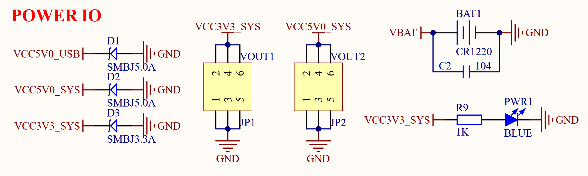

# 3.3 电源输出接口

&emsp;&emsp;开发板板载两组电源输出接口，原理图如下图所示：

 
图3.3.1 电源输出接口

&emsp;&emsp;图中VOUT1和VOUT2分别是3.3V和5V的电源输出接口，可以通过开发板给外部提供 3.3V和5V电源，方便用户进行扩展使用。

&emsp;&emsp;图中D1、D2和D3为TVS管，可以有效避免VOUT外接电源/负载不稳的时候（尤其是开发板外接电机/继电器/电磁阀等感性负载的时候），对开发板造成的损坏。同时还能一定程度防止外接电源接反，对开发板造成损坏。

&emsp;&emsp;VBAT是开发板上AT8563T这个RTC芯片的纽扣电池，用于在开发板掉电的时候保存RTC时间。PWR1是开发板电源指示灯，开发板如果上电正常，那么此指示灯就会亮。

