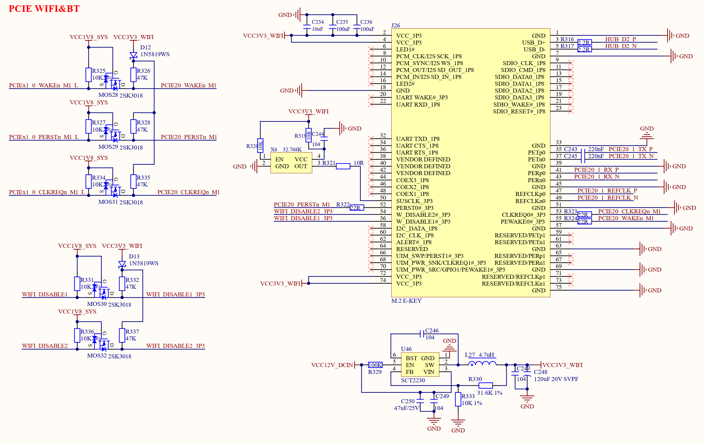

# 3.30 PCIE WIFI&BT接口

&emsp;&emsp;ATK-DLRK3588B开发板板载一个PCIE接口的WIFI&BT座，原理图如图3.30.1所示：

 
图3.30.1 PCIE WIFI&BT接口

&emsp;&emsp;图3.30.1中J26就是PCIE WIFI&BT模块接口，为E-KEY接口，如果大家需要更高性能的WIFI连接，就可以使用外接的PCIE WIFI&BT模组，比如RTL8852、AX200等。U46是一个DCDC芯片，型号为SCT2230，用来给PCIE WIFI&BT提供独立的3.3V供电。
