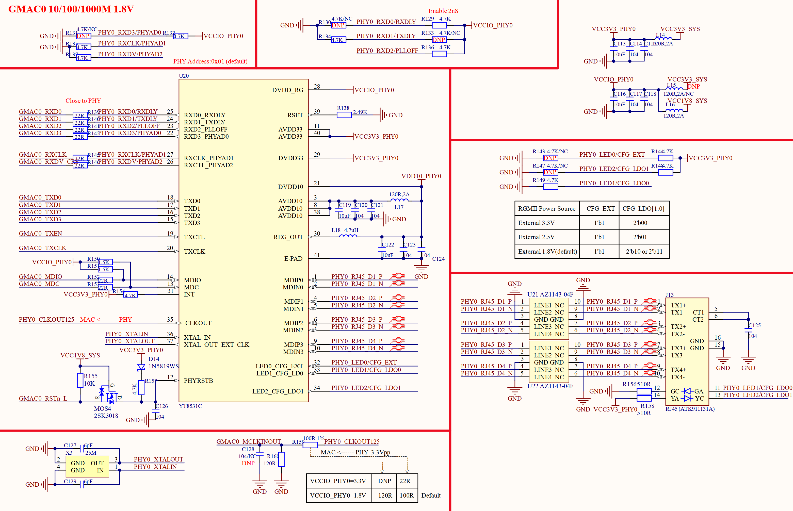

# 3.5 千兆网络接口ETH0

&emsp;&emsp;正点原子ATK-DLRK3588B开发板有两个千M以太网接口， ETH0这一路千M以太网接口原理图如图3.5.1所示：

 
图3.5.1 ETH0千M兆网络原理图

&emsp;&emsp;RK3588的ETH0需要外接一个支持千M网络的PHY芯片实现千M网络联网，图中U20就是一颗10/100/1000M的PHY芯片，型号为YT8531C，Pin to Pin兼容RTL8211F，因此在我们的开发板上YT8531C和RTL8211F可以随意互换。

&emsp;&emsp;图中J13就是支持千M网络的RJ45座，型号为ATK91131A(也可以使用汉仁的HR911131A)，此RJ45座内部集成了网络变压器，所以大家在图3.5.1中并没有看到网络变压器。如果开发板要工作在千M模式，对方设备也必须工作在千M模式，如果对方设备工作在10/100M模式，那么开发板PHY芯片会通过自动协商也降低到10/100M模式。

