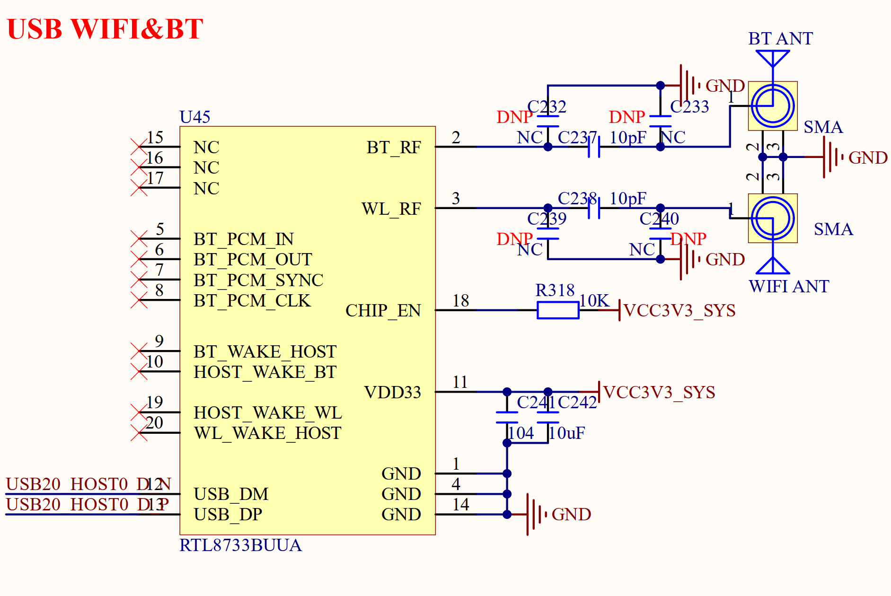

# 3.8 USB WIFI&蓝牙模块

&emsp;&emsp;正点原子ATK-DLRK3588B开发板板载一个USB WIFI&蓝牙模块，如图3.8.1所示：

 
图3.8.1 USB WIFI&蓝牙接口

&emsp;&emsp;U45就是就是开发板所使用的WIFI&蓝牙模块，型号为RTL8733，这是一个USB接口的WIFI&蓝牙模块，支持双频WIFI。连接到了RK3588的USB20_HSOT0接口上，仅通过一个USB口即可实现WIFI和蓝牙功能。
	
&emsp;&emsp;图3.8.1中WIFI_ANT为WIFI天线，需要使用支持5G的双频WIFI天线。BT_ANT是蓝牙天线接口，一共2个天线。

