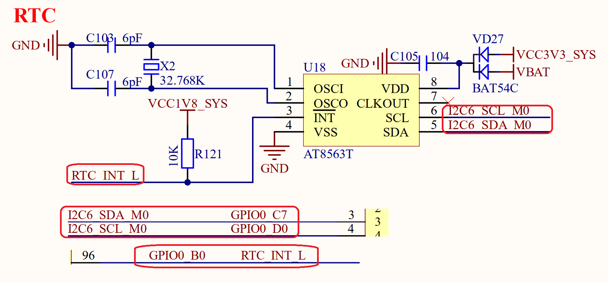

# 3.9 RTC与纽扣电池供电

&emsp;&emsp;ATK-DLRK3588B开发板板载AT8563T这颗外置RTC芯片以及相关的纽扣电池供电电路，原理图如图3.9.1所示：

 
图3.9.1 RTC芯片以及纽扣电池

&emsp;&emsp;图3.9.1中U18就是外置的RTC芯片AT8563T，VBAT就是CR1220纽扣电池座，当开发板上电的时候AT8563T使用开发板3.3V电源供电。当开发板断电以后纽扣电池给AT8563T供电，这样就实现了RTC不掉电运行，可以长久保持时间。如果发现RTC时间无法保存，那么可能是纽扣电池没电了，请自行更换纽扣电池。

